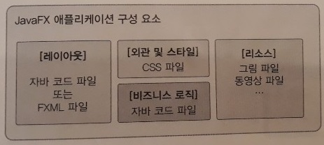
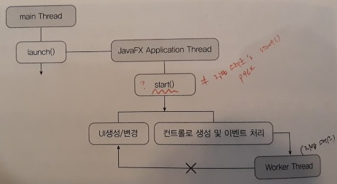
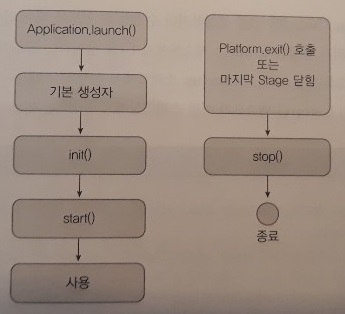
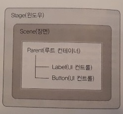
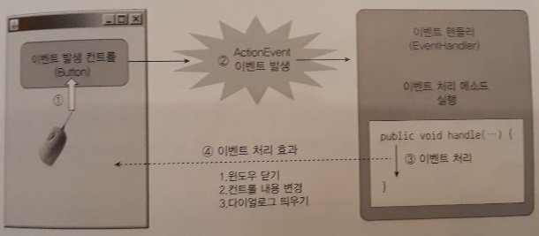
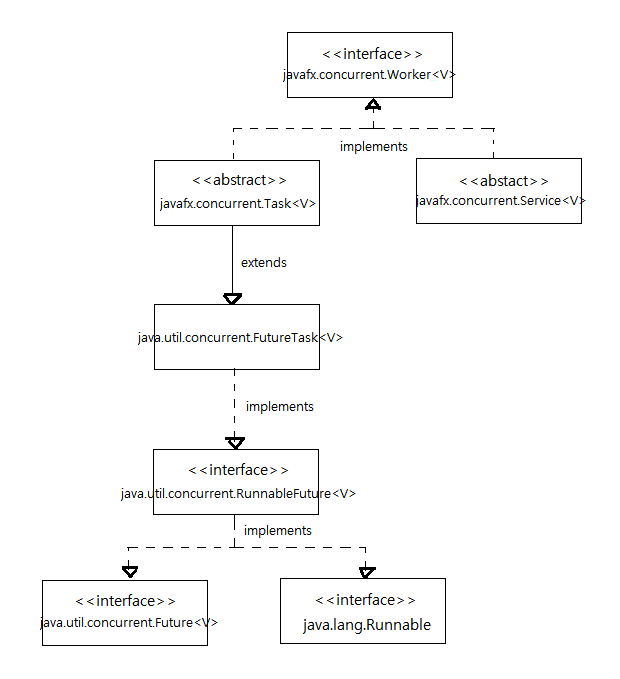

JavaFX
=====
* 자바 7부터 JDK에 포함(∴ 별도의 SDK 설치 없이 사용 가능)
* JavaFX 애플리케이션
	* UI 생성, 이벤트 처리, 멀티미디어 재생, 웹 뷰 → JavaFX API
	* 그 외 기능 → 자바 표준 API
* MVC 패턴
- - -
## 목차
1. [UI](#UI)
	* [라이프사이클](#라이프사이클)
	* [레이아웃](#레이아웃)
	* [이벤트 핸들러](#이벤트-핸들러)
	* [리스너](#리스너)
2. [스레드 동시성](#스레드-동시성)
	* [클래스 계층도](#클래스-계층도)

## UI
</br>

### 라이프사이클
</br>

* JavaFX 애플리케이션을 시작시키는 메인 클래스는 추상 클래스인 javafx.application.Application을 상속받고, start() 메소드 재정의
* main() 메소드에서 Application의 launch() 메소드 호출
* launch() 메소드는 메인 클래스의 객체를 생성하고, 메인 윈도우(javafx.stage.Stage)를 생성한 다음 start() 메소드를 호출

</br>

* 메인 클래스의 기본 생성자를 호출해서 객체를 생성하고, 이어서 init() 메소드 호출
* init()이 끝나면 start() 메소드 호출해서 메인 윈도우 실행
* init()과 stop() 메소드는 옵션이므로 필요한 경우 재정의

주목할 점은 라이프사이클 각 단계에서 호출되는 메소드가 서로 다른 스레드상에서 실행된다는 점이다.

* main 스레드(∵ JVM): Application.launch() 실행
* JavaFX-Launcher(∵ launch 메소드): init() 실행
* JavaFX Application Thread(∵ launch 메소드): 메인 클래스 기본 생성자, start() 및 stop() 실행

- - -
* JavaFX Application Thread만 UI 생성 및 수정 가능(∴ 다른 스레드가 UI에 접근 시 예외 발생)
* 예로 init() 메소드에서 UI 수정 코드 작성하면 예외 발생(∵ init 메소드는 JavaFX-Launcher 스레드 실행)

##### [목차로 이동](#목차)

### 레이아웃
레이아웃을 설명하기 앞서, 무대(Stage)와 장면(Scene)에 대해 설명해본다.

</br>

* JavaFX는 윈도우를 무대(Stage)로 표현
* 무대는 한 번에 하나의 장면(javafx.scene.Scene)을 가질 수 있음
* 메인 윈도우와 다르게 장면(Scene)은 직접 생성 필요
	* 메인 윈도우는 start() 메소드의 primaryStage 매개값으로 전달
* 장면 생성 위해서는 UI의 루트 컨테이너인 javafx.scene.Parent 필요  
	```java
	Scene scene = new Scene(Parent root);
	```
* Parent로는 주로 javafx.scene.layout 패키지의 [컨테이너](#컨테이너) 사용(∵ Parent는 추상 클래스)
* 장면(Scene) 생성 후 윈도우(Stage)에 올림  
	```java
	primaryStage.setScene(scene);
	```
한편 레이아웃이란, 장면(Scene)에 포함되는 다양한 컨트롤들을 배치하는 것을 말한다. 이러한 레이아웃을 작성하는 방법은 두 가지가 있다.

* 자바 코드 작성(프로그램적 레이아웃)
	* 레이아웃이 복잡해지면 코드가 복잡해짐
	* 디자이너와 협력 어려움
	* 수정시 재컴파일 단점
* FXML 작성(선언적 레이아웃)

이때 만약 FXML 파일로 작성했다면, FXML 파일을 읽어 선언된 내용을 객체화해야 한다. 이것을 FXML 로딩이라고 하며, 이를 위해서는 javafx.fxml.FXMLLoader를 사용해야 한다. 간단히 예를 들면 아래와 같이 작성할 수 있다.

```java
// 1. 정적 메소드
Parent root = FXMLLoader.load(getClass().getResource("xxx.fxml"));

// 2. 인스턴스 메소드
FXMLLoader loader = new FXMLLoader(getClass().getResource("xxx.fxml"));
Parent root = (Parent) loader.load();

// 아래와 같이도 사용 가능
HBox hbox = (HBox) FXMLLoader.load(getClass().getResource("xxx.fxml"));
```

##### [목차로 이동](#목차)

#### 컨테이너
JavaFX 컨테이너란 레이아웃을 작성할 때 컨트롤들을 쉽게 배치할 수 있도록 도와주는 클래스를 말한다. javafx.scene.layout 패키지에 다양한 컨테이너 클래스들이 존재한다. 예를 들어 접미사가 Pane으로 끝나는 클래스는 모두 컨테이너이고, 그 외에 Hbox, Vbox가 있다.

##### [목차로 이동](#목차)

### 이벤트 핸들러
</br>

* JavaFX는 이벤트 처리 시 위임형(Delegation) 방식 사용
	* 위임형 방식이란 컨트롤에서 이벤트 발생 시, 컨트롤이 직접 처리하지 않고 이벤트 핸들러에게 처리를 위임하는 방식
* EventHandler가 컨트롤에서 발생된 이벤트를 처리하려면, 컨트롤에 EventHandler 등록 필요  
	```java
	// 버튼 클릭 시
	Button button = new Button();
	button.setOnAction(new EventHandler<ActionEvent>() {
		@Override
		public void handle(ActionEvent event) { ... }
	});
	
	// 테이블 행 클릭 시
	TableView tableView = new TableView();
	tableView.setOnMouseClickd(new EventHandler<MouseEvent>() {
		@Override
		public void handle(MouseEvent event) { ... }
	});
	
	// 윈도우(Stage) 우측 상단 닫기 클릭 시
	stage.setOnCloseRequest(new EventHandler<WindowEvent>() {
		@Override
		public void handle(WindowEvent event) { ... }
	});
	```
	* 이때 EventHandler는 제네릭 타입이기 때문에 타입 파라미터는 발생된 이벤트의 타입
* EventHandler는 하나의 메소드를 가진 함수적 인터페이스이므로 람다식 이용 가능  
	```java
	button.setOnAction(event -> { ... });
	tableView.setOnMouseClickd(event -> { ... });
	stage.setOnCloseRequest(event -> { ... });
	```

프로그램적 레이아웃은 레이아웃 코드와 이벤트 처리 코드를 모두 자바 코드로 작성해야 하므로 권장하지 않는다. 반면 FXML 레이아웃은 FXML 파일당 별도의 컨트롤러(Controller)를 지정해서 이벤트를 처리할 수 있기 때문에 FXML 레이아웃과 이벤트 처리 코드를 완전히 분리할 수 있다.

* FXML 파일 루트 태그에서 fx:controller 속성으로 컨트롤러 지정(→ UI 컨트롤 발생 이벤트를 컨트롤러가 처리)
* 컨트롤러는 Initializable 인터페이스 구현 클래스로 작성  
	```java
	public class ControllerName implements Initializable {
		@FXML
		private Button btn1;
		@FXML
		private Button btn2;
		@FXML
		private Button btn3;
		@Override
		public void initialize(URL location, ResourceBundle resources) { }
	}
	```
	* initialize() 메소드는 컨트롤러 객체 생성 후 호출  
	  (주로 UI 컨트롤 초기화, 이벤트 핸들러 등록, 속성 감시 등 코드 작성)
	* fx:id 속성 가진 컨트롤들이 컨트롤러의 @FXML 어노테이션이 적용된 필드에 자동 주입  
	  (∵ 컨트롤 속성값과 컨트롤러 필드명 동일)
* 컨트롤러에서 EventHandler를 생성하지 않더라도 컨트롤에서 onAction 속성값으로 '#메소드명'을 주면 이벤트 처리 메소드와 연결 가능

##### [목차로 이동](#목차)

### 리스너
JavaFX는 컨트롤의 속성(property)을 감시하는 리스너를 설정할 수 있다. 예를 들어 text 속성값을 감시하는 리스너는 다음과 같이 설정한다.

```java
// JavaFX 컨트롤은 세 가지 메소드로 구성
private StringProperty text = new SimpleStringProperty();
public void setText(String newValue) {
	text.set(newValue);
}
public String getText() {
	return text.get();
}
public StringProperty textProperty() {
	return text;
}

// text 속성을 감시하는 리스너 설정
textProperty().addListener(new ChangeListener<String>() {
	@Override
	public void changed(ObservableValue<? extends String> observable, String oldValue, String newValue) {
	}
});
```

이때 ChangeListener는 제네릭 타입인데, 타입 파라미터는 속성의 타입이 된다. 예를 들어 textProperty()가 리턴하는 StringProperty는 Property<String>을 구현하고 있기 때문에 타입 파라미터는 <String>이 된다. 따라서 oldValue와 newValue의 타입은 String이 된다.

한편 JavaFX 속성은 다른 속성과 바인딩될 수 있는데, 속성을 바인딩하기 위해서는 xxxProperty() 메소드가 리턴하는 Property 구현 객체의 bind() 메소드를 이용하면 된다.

##### [목차로 이동](#목차)

## 스레드 동시성


##### [목차로 이동](#목차)

### 클래스 계층도
</br>

##### [목차로 이동](#목차)
