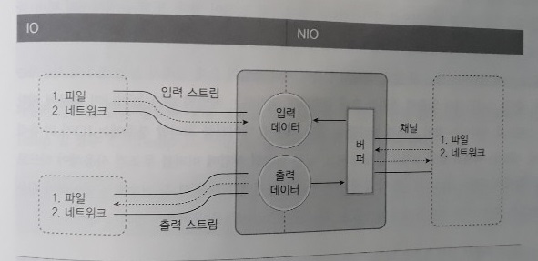

NIO 기반 입출력 및 네트워킹
=====
* 자바 4부터 java.nio 패키지 포함
* 자바 7에서 NIO.2 API 추가
- - -
## 목차
1. [소개](#소개)
	* [스트림과 채널](#스트림과-채널)
	* [넌버퍼와 버퍼](#넌버퍼와-버퍼)
	* [블로킹과 논블로킹](#블로킹과-논블로킹)
2. .

## 소개
IO와 NIO는 데이터를 입출력한다는 목적은 동일하지만, 방식에 있어서 크게 차이가 난다.

| 구분 | IO | NIO |
| -- | -- | -- |
| 입출력 방식 | 스트림 방식 | 채널 방식 |
| 버퍼 방식 | 논버퍼 | 버퍼 |
| 비동기 방식 | 지원 안함 | 지원 |
| 블로킹 방식 | 블로킹 방식만 지원 | 블로킹/논블로킹 모두 지원 |

##### [목차로 이동](#목차)

### 스트림과 채널
* IO는 스트림(Stream) 기반
	* 하나의 파일에서 데이터를 읽고 저장하는 작업을 모두 하기 위해서는 FileInputStream과 FileOutputStream 별도 생성 필요
* NIO는 채널(Channel) 기반
	* 스트림과 달리 양방향 입출력 가능
	* 하나의 파일에서 데이터를 읽고 저장하는 작업을 하기 위해 하나의 FileChannel 생성 필요

##### [목차로 이동](#목차)

### 넌버퍼와 버퍼
NIO는 기본적으로 버퍼를 사용해서 입출력을 하기 때문에 IO보다는 입출력 성능이 좋다. 채널은 버퍼에 저장된 데이터를 출력하고, 입력된 데이터를 버퍼에 저장한다.

 

IO는 스트림에서 읽은 데이터를 즉시 처리[^note01]한다. 그렇기 때문에 스트림으로부터 입력된 전체 데이터를 별도로 저장하지 않으면, 입력된 데이터의 위치를 이동해가면서 자유롭게 이용할 수 없다.

- - -
[^note01]: 이런 시스템은 대체로 느리다. 이것보다는 버퍼(메모리 저장소)를 사용해서 복수 개의 바이트를 한꺼번에 입력받고 출력하는 것이 빠른 성능을 낸다. 그래서 IO는 버퍼를 제공해주는 보조 스트림인 BufferedInputStream, BufferedOutputStream을 연결해서 사용하기도 한다.

##### [목차로 이동](#목차)

### 블로킹과 논블로킹

##### [목차로 이동](#목차)
