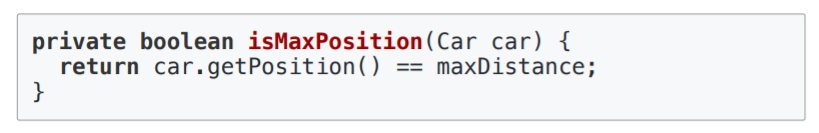

Double dispatch
=====
코딩에 무리가 없게끔, 이해한만큼 간결하게 정리하고 보충한다.
- - -
## 목차
1. [계기](#계기)
2. [개념](#개념)
3. [연관](#연관)
	* [우아한테크코스](#우아한테크코스)
	* [토비의봄](#토비의봄)

## 계기
[코드스피츠](https://www.youtube.com/watch?v=0j_eGoF8Q98&t=4724s)라는 강의형 유투브를 통해 처음 접한 개념인데 언어를 떠나 프로그래밍에서 가장 기저가 되는 개념 중 하나라는 생각에 정리해본다.  

 

## 개념
위에 이것저것 써놨지만, ~~(아직 메모리 등의 개념은 이해하지 못했고)~~ 간략히 정리하면 이렇다. 

1. 변수에 할당될 수 있는 것은 두 가지다.
	* 값(ex. A = "TEST")
	* 주소(ex. B = &A)
	* 참고
		* 흔한 예로 변수 B로부터 참조의 참조, 즉 TEST를 얻을 수 있다.
2. 이때 주소를 참조하고 있는 변수인 경우 문제가 생길 수 있다.
	* 이런 상황이 있다고 가정해보자.
		1. A = "TEST" 
		2. B = &A
		3. C = B
		4. D = B
		5. K = "ABC"
		6. B = &K
	* 뭐가 문제인데?
		* B에 담긴 주소값이 바뀌었으니 B로부터 "ABC"가 나오는 건 당연하다.
		* 문제는 C, D다.
			* C, D에 B를 넣었다는 것은 B와 똑같이 C, D로부터 "ABC"를 얻을 수 있어야 함을 의미한다.
			* 하지만 C, D는 B와 다르게 여전히 "TEST"를 가리키고 있다.
3. 값을 참조하지 않고 주소를 참조, 즉 참조를 참조할 때 발생하는 문제이다.
	* 해결책~~(이해 못해서 다시 들어봐야 됨)~~
		* ~~B = &A~~  
		B = {VALUE:&A, V=3}
		* C = B
		* D = B
	* 즉 변경하는 값을 한 번 포장해서 사용함으로써 문제를 해결할 수 있다.

## 연관
### 우아한테크코스
몇 개월 전 흥했던 [우아한테크코스](http://woowabros.github.io/woowabros/2019/05/02/techcourse.html) 후기를 보던 중 아래와 같은 문장이 있었다.  

* [원시 타입과 문자열을 포장하라](http://woowabros.github.io/files/2019-05-02/precourse_3rd_feedback.pdf)
	* 구입 금액을 Money 객체로 포장  
	 
	* 로또 숫자 하나를 LottoNumber 객체로 포장  
	 

위 강의를 들으며 이 글이 떠올랐다. 어렴풋이 자바에서 이런 식으로 값을 래핑해서 사용하는 이유가 Double dispatch를 위해서 그런 거 아닐까 하는 생각이 들었다. 그리고 이렇게 감쌌을 때 가능해지는 얘기가 바로 아래가 아닐까 싶다.  

* [객체에 메시지를 보내라](http://woowabros.github.io/files/2019-05-02/precourse_2nd_feedback.pdf)
	* 상태 데이터를 가지는 객체에서 데이터를 꺼내려(get)하지 말고 객체에 메시지를 보내라
	* 예. Car가 우승자인지를 판단하기 위해 최대 이동 거리 값을 가지는 Car인지 판단할 수 있는 기능
		* 틀린 메소드 호출  
		 
		* 올바른 메소드 호출  
		 

이는 MVC 패턴에서도 익숙하고, 리팩토링 책에서도 흔히 볼 수 있는 예인 것 같다.
		
### 토비의봄
Double dispatch라는 키워드로 검색하다가 유명 개발자인 토비님이 언급하신 걸 정리한 [블로그](https://multifrontgarden.tistory.com/133)를 발견했다. 사실 글쓴분도 개발 관련 커뮤니티에서 익숙한 닉이라 알고 있었다.  

추후 정리-

* [Dispatch - Single/Multiple/Dynamic/Double](http://codethataint.com/blog/single-dispatch-multiple-dispatch-dynamic-dispatch-double-dispatch/)