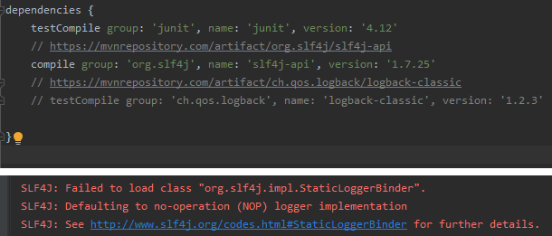

로깅
=====
## 목차
1. [개념](#개념)
	1. [로깅이란](#로깅이란)
	2. [로깅 유틸리티](#로깅-유틸리티)
2. [코드](#코드)
	1. [Slf4j](#Slf4j)
	2. .
3. [참고](#참고)

## 개념
### 로깅이란
로깅(Logging)이란 로그(Log)를 기록하는 행위를 말한다. 여기서 로그란 프로그램의 실행 중에 정보를 제공하는 일련의 기록을 말하는데 구체적으로는 다음과 같다.

> Logging is used to store exceptions, information, and warnings as messages  
> that occur during the execution of a program.

따라서 적절한 로깅은 개발자에게 디버깅을 수월하게 해준다. 개발 초보 입장에서, 또 로깅 라이브러리를 별도로 사용하지 않는다면 `System.out.println()`으로 로깅을 하겠지만 아래와 같은 이유로 비권장한다.

1. 에러/장애 발생 시 추적하는 데 필요한 최소한의 정보가 없다
	* 날짜/시간 등 정보 없음
	* 멀티스레드 환경에서 사용하기 힘듦(비동기?)
2. 운영 환경에서 사용 시 리소스 낭비의 문제가 있다
3. 출력을 다양하게 할 수 없다

##### [목차로 이동](#목차)

### 로깅 유틸리티
위에 언급한 이유로 `System.out.println()` 대신 자바에서 사용할 수 있는 몇 가지 로깅 옵션(프레임워크)이 존재한다. 이들 프레임워크는 로그 메시지를 작성하고 전송하는 데 필요한 오브젝트, 메소드 및 구성을 제공한다.

1. java.util.logging
	* 자바 1.4부터 제공되는 로깅 유틸리티  
	(이미 Log4j 존재하던 시점)
	* 타 라이브러리와 비교 시 퍼포먼스 느림
2. Log4j
	* apache.commons.logging의 구현  
	(Log4j Apache Commons Logging은 구체적 구현을 위한 추상화)
	* 3개의 컴포넌트로 구성
		1. logger: 데이터를 기록하는 역할
		2. appender: 데이터를 어디에 기록할지 정하는 역할
		3. layout: 데이터를 어떤 스타일로 기록할지 정하는 역할
	* 여러 종류의 appender를 지원
	* thread safe
	* 2020년 Log4j2 출시
3. Logback
	* [Logback을 사용해야 하는 이유](https://lalwr.blogspot.com/2016/03/logback.html)
	* .

한편 Slf4j[1] 및 Apache Commons Logging과 같은 추상화 계층[2]을 사용하여 기본 로깅 프레임워크에서 코드를 분리하여 프레임워크간 즉시 전환할 수 있다. 

- - -
* [1](출처: [Slf4j](https://kwonnam.pe.kr/wiki/java/slf4j))
	* 여러 로거를 선택해 사용할 수 있게 해주는 로깅 파사드  
	(Logback과 조합해서 많이 사용)
	* Jakarta Commons Logging(JCL)과 비슷한 기능이나 퍼포먼스 우위
* [2]
	* [Which design pattern is more suitable for logging?](https://softwareengineering.stackexchange.com/questions/221490/which-design-pattern-is-more-suitable-for-logging)
	* [Java Facade Design Pattern Example](https://examples.javacodegeeks.com/core-java/java-facade-design-pattern-example/)
	* [Logging Using the Composite Pattern](https://www.codeproject.com/Articles/14824/Logging-Using-the-Composite-Pattern)

##### [목차로 이동](#목차)

## 코드
### Slf4j
* [Slf4j 로깅 정리](https://sonegy.wordpress.com/2014/05/23/how-to-slf4j/)
* [Slf4j 이용 Log4j](http://whiteship.me/?p=12162)
* [Slf4j 설정 이슈](https://blog.outsider.ne.kr/561)

##### [목차로 이동](#목차)

#### Slf4j + Logback
 

 

##### [목차로 이동](#목차)

## 참고
* [Java Logging Functionality](https://medium.com/@TechExpertise/java-logging-functionality-103a412caa1e)
* [Java Logging Basics](https://www.loggly.com/ultimate-guide/java-logging-basics/)
* tutorial
	1. [Logging with Log4j in Java](https://dzone.com/articles/logging-with-log4j-in-java)
	2. [Log4j Example](https://www.javatpoint.com/log4j-example)
	3. [Getting started with Java Logging](https://www.logicbig.com/tutorials/core-java-tutorial/logging/getting-started.html)
	4. [Log4j hello world example](https://mkyong.com/logging/log4j-hello-world-example/)

- - -

* [Log4j2 설정하기](http://dveamer.github.io/java/Log4j2.html)
* [아키텍처 설계: Logback을 활용한 Remote Logging](http://www.nextree.co.kr/p5584/)

##### [목차로 이동](#목차)