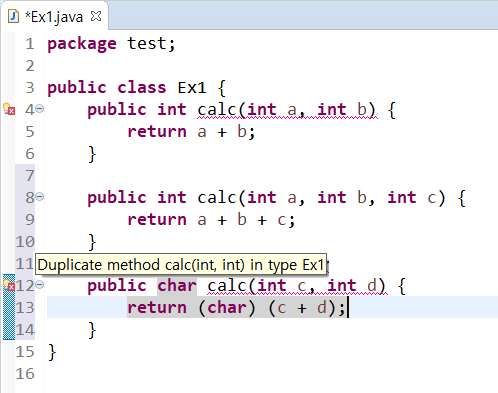
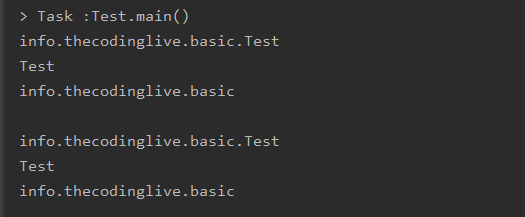

다형성: 인터페이스와 리플렉션
=====
리플렉션보다는 인터페이스를 사용하라
- - -
## 목차
1. [개요](#개요)
2. [인터페이스](#인터페이스)
	* [상속보다는 합성](#상속보다는-합성)
3. [리플렉션](#리플렉션)
	* [리플렉션보다는 인터페이스](#리플렉션보다는-인터페이스)
	* [어노테이션과 리플렉션](#어노테이션과-리플렉션)
4. [참고](#참고)

## 개요
[`리플렉션`보다는 `인터페이스`를 사용하라](https://jaehun2841.github.io/2019/03/03/effective-java-item65/#%EC%84%9C%EB%A1%A0)라는 글을 접하고 이해한대로 정리해보고자 한다. 이 두 개념을 같은 층위에 놓고 비교했고, 나는 아래 개념을 그 기준점으로 삼았다.  

* 다형성이란
	* 한 타입의 참조변수로 여러 타입의 객체를 참조할 수 있도록 함을 구현하는 데 사용
	* 개인적으로 위 주제(`리플렉션보단 인터페이스를 사용하라`)의 문맥에서 생각해보면 다형성이란 [런타임 시 동적 바인딩](https://github.com/nara1030/ThisIsJava/blob/master/docs/etc/dynamic_loading.md)(ex. 메소드 오버라이딩) 같음(`객체 지향에서의 다형성이 더 큰 개념인지 모르겠음`)
	* 참고
		* [위키백과 - 다형성](https://ko.wikipedia.org/wiki/%EB%8B%A4%ED%98%95%EC%84%B1_(%EC%BB%B4%ED%93%A8%ED%84%B0_%EA%B3%BC%ED%95%99))
		* [제타위키 - 다형성](https://zetawiki.com/wiki/%EB%8B%A4%ED%98%95%EC%84%B1)
* 다형성을 구현하는 방법
	* 인터페이스(상속/구현)
	* 리플렉션

**좀 더 깊이**

* [메서드 시그니처](https://wanna-b.tistory.com/75)(Method signature)란
	* `메서드 이름`과 `매개변수 리스트`
		* 자바 컴파일러는 [메서드 이름과 매개변수 리스트](https://stackoverflow.com/questions/16149285/does-a-methods-signature-in-java-include-its-return-type)를 통해 메서드 간 차이를 식별(`오버로딩`)  
		</br>
	* (위에서 답이 나왔지만) 왜 `리턴타입`은 빼고 이 두 가지만?
		* [다형성에 입장에서 생각](https://bitsoul.tistory.com/55)해보면, 리턴 타입은 재정의 가능해야 함(`오버라이딩`)
			* 원칙적으로 상속 관계에서 메소드 오버라이딩은 `리턴타입`, `메소드 이름`, `매개변수 리스트`가 완전히 동일해야 함
			* 그러나 `리턴타입`에 있어서는 다형성 때문에 자동 형변환이 발생할 수 있다면 재정의 허용
	
##### [목차로 이동](#목차)
	
## 인터페이스
* 인터페이스란(두 가지 측면에서 생각할 수 있음)
	1. 사용자가 사용할 수 있는 일종의 API
		* 하나의 인터페이스를 구현한 두 개의 서로 다른 구현체는 그 사용 방법은 동일(ex. Set과 List)
	2. 해당 인터페이스를 구현한 어떠한 구현체도 참조 가능하다는 점에서 다형성의 수단

##### [목차로 이동](#목차)

### 상속보다는 합성
* 상속 vs 합성
	* gimmesilver's blog
		* [상속과 합성 - (1)](http://agbird.egloos.com/615107)
		* [상속과 합성 - (2)](http://agbird.egloos.com/615166)
		* [상속과 합성 - (3)](http://agbird.egloos.com/615237)
	* [객체지향 프로그래밍 입문 by cheese10yun](https://github.com/cheese10yun/TIL/blob/master/OOP/%EA%B0%9D%EC%B2%B4-%EC%A7%80%ED%96%A5-%ED%94%84%EB%A1%9C%EA%B7%B8%EB%9E%98%EB%B0%8D-%EC%9E%85%EB%AC%B8.md)
	* 인터페이스 vs 추상클래스
	
##### [목차로 이동](#목차)
	
## 리플렉션
리플렉션에 관한 설명을 발췌해본다.

> Reflection은 컴퓨터 프로그램에서 **런타임 시점**에 사용되는 자신의 구조와 행위를 관리(type introspection)하고 수정할 수 있는 프로세스를 의미한다. 즉 "type introspection"은 객체 지향 언어에서 런타임에 객체의 형(type)을 결정할 수 있는 능력을 의미한다.  
> 출처: [위키백과](https://ko.wikipedia.org/wiki/%EB%B0%98%EC%98%81_(%EC%BB%B4%ED%93%A8%ED%84%B0_%EA%B3%BC%ED%95%99))

즉, 런타임 시 변수에 구현체(객체)가 바인딩된다는 관점(Not `컴파일 타임`)에서 바라본다면 `리플랙션` 또한 `인터페이스`와 비슷하다. 좀 더 구체적인 설명은 아래와 같다.

> 자바의 모든 클래스는 그 클래스 자체의 구성정보를 담은 Class 타입의 오브젝트를 하나씩 갖고 있다. '클래스이름.class'라고 하거나 오브젝트의 getClass() 메소드를 호출하면 클래스 정보를 담은 Class 타입의 오브젝트를 가져올 수 있다.  
> 출처: [토비의 스프링 3.1 Vo1.1 6장](https://countryxide.tistory.com/75)

그럼 리플렉션은 왜 사용하는 것일까? 그 해답은 바로 위의 언급대로 리플렉션이 구체적인 클래스 타입을 알지 못해도, 그 클래스의 메소드, 타입, 변수들에 접근(∵ Class 오브젝트)할수 있도록 해주기 때문이다. 아래는 [관련 예제 코드](https://cornswrold.tistory.com/352)다.

```java
// main 메서드 내부
// 방법 1
Test test = new Test();
Class aClass1 = test.getClass();
System.out.println(aClass1.getName());
System.out.println(aClass1.getSimpleName());
System.out.println(aClass1.getPackage().getName());
System.out.println();

// 방법 2
try {
	Class aClass2 = Class.forName("info.thecodinglive.basic.Test");
	System.out.println(aClass2.getName());
	System.out.println(aClass2.getSimpleName());
	System.out.println(aClass2.getPackage().getName());
} catch (ClassNotFoundException e) {
	e.printStackTrace();
}
```

</br>

두 경우의 실행결과가 같음을 확인할 수 있다. 정리하면 자바는 클래스와 인터페이스의 메타데이터를 java.lang 패키지가 소속된 Class 클래스로 관리한다(메타 데이터: 클래스의 이름, 생성자 정보, 필드 정보, 메소드 정보). 이 Class 객체를 얻기 위해 예제 코드에서 확인했듯 두 가지 방법이 있다.

* 방법 1: 해당 클래스로 Class 객체를 얻기  
	```java
	Test test = new Test();
	Class aClass1 = test.getClass();
	```
* 방법 2: 객체를 생성하기 전 Class 객체 얻기  
	```java
	Class aClass2 = Class.forName("info.thecodinglive.basic.Test");
	// 아래로 대체 가능(try-catch문 불필요)
	Class aClass2 = Test.class;
	```

그리고 이렇게 얻은 Class 객체를 이용하면 new 연산자를 사용하지 않고 동적으로 객체를 생성(`newInstance()`)할 수 있다(∴ 런타임 시에 클래스 이름이 결정되는 경우 유용).

```java
try {
	Class aClass = Class.forName("런타임 시 결정되는 클래스명");
	Object obj = aClass.newInstance();
} catch(Exception e) {
}
```

추가로 리플렉션이 가능한 이유는 자바 클래스 파일은 바이트 코드로 컴파일되어 static 영역에 위치하므로 클래스 이름만 알고 있다면 언제든 이 영역을 뒤져서 클래스에 대한 정보를 가져올 수 있는 것이다(`?`).

- - -
* [`이것이 자바다`](https://github.com/nara1030/ThisIsJava) 교재에서도 리플렉션에 대해 언급
	* [클래스 - 어노테이션](https://github.com/nara1030/ThisIsJava/blob/master/docs/%ED%81%B4%EB%9E%98%EC%8A%A4.md)
	* [기본 API 클래스 - Class 클래스](https://github.com/nara1030/ThisIsJava/blob/master/docs/%EA%B8%B0%EB%B3%B8%20API%20%ED%81%B4%EB%9E%98%EC%8A%A4.md)

##### [목차로 이동](#목차)

### 리플렉션보다는 인터페이스
위에서 리플렉션이 필요한 경우를 살펴봤다. 일반적으로는 접하기 힘들지만, 코드를 작성할 시점에 어떤 타입의 클래스를 사용할지 모르는 경우가 그것이다. 즉 런타임에 지금 실행되고 있는 클래스(`?`)를 가져와서 실행하는 경우이다. 대표적으로 이런 기능이 쓰이는 경우로 IntelliJ의 자동완성, 스프링 프레임워크의 어노테이션을 들 수 있다.

> 스프링을 공부하다 보면 BeanFactory라는 이름의 Spring Container 개념을 학습하게 된다. BeanFactory는 애플리케이션이 실행된 후 호출 시점, 즉 런타임에 객체의 인스턴스를 생성하게 되는데 이때 필요한 기술이 바로 Reflection이다.  
> 출처: [Java Reflection 개념 및 사용법](https://gyrfalcon.tistory.com/entry/Java-Reflection)

하지만 둘 다 가능한.

##### [목차로 이동](#목차)

### 어노테이션과 리플렉션
추후 정리.

* [자바 어노테이션과 리플렉션이란?](https://qssdev.tistory.com/27)
* [어노테이션과 리플렉션을 이용한 메소드 실행시간 출력하기](https://118k.tistory.com/106)

##### [목차로 이동](#목차)

## 참고
추후 정리.

* [자바 리플렉션에 대한 오해와 진실 - socurites님](java_reflection_by_socurites.pdf)
* 실무 - nhj12311님
	* [기본](https://steemit.com/kr-dev/@nhj12311/java-reflection)
	* [활용](https://steemit.com/kr-dev/@nhj12311/2-java-reflection)
	* [BCI](https://steemit.com/kr-dev/@nhj12311/bci-java-bci-byte-code-instrumentation-1)
	* [AOP - Dynamic Proxy](https://busy.org/@nhj12311/aop-jdk-dynamic-proxy-java-aop-2)
* 팩토리 패턴과 리플렉션
	* [리플랙션 패턴](https://m.blog.naver.com/PostView.nhn?blogId=since890513&logNo=220220758867&proxyReferer=https%3A%2F%2Fwww.google.com%2F)
	* [Factory Pattern](https://www.oodesign.com/factory-pattern.html)
	* [Abstract Factory, Factory Method vs Reflection](https://www.linkedin.com/pulse/abstract-factory-method-vs-reflection-eman-mughal/)
	* [Factory via Reflection](http://technojeeves.com/index.php/65-java-factory-via-reflection-and-properties)
* 추후 공부
	* [자바 API 인터페이스 사례](https://github.com/nara1030/spring-basic/blob/master/book/oop_for_spring_jmkim/ch_3.md#%EC%83%81%EC%86%8D%EA%B3%BC-%EC%9D%B8%ED%84%B0%ED%8E%98%EC%9D%B4%EC%8A%A4)
	
##### [목차로 이동](#목차)