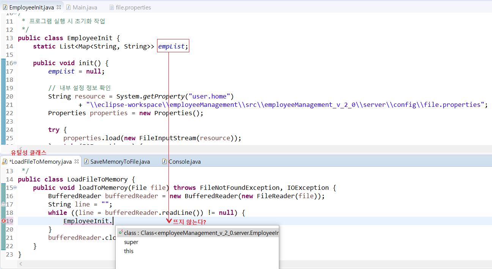

static vs. non-static
=====
## 목차
1. [개요](#개요)
2. [static 멤버](#static-멤버)
3. [인스턴스 멤버](#인스턴스-멤버)
4. [참고](#참고)

## 개요
 

일전에 코딩하면서 `"static으로 생성했는데 왜 다른 클래스에서 사용하지 못하지?"`라고 오해(∵ static 멤버는 동일한 클래스의 모든 객체들에 의해 공유)했었다. 뿐만 아니라 멤버 선언 시 static과 non-static 중 어느 것으로 선언해야 할지 혼동되는 부분이 있어서 정리해보고자 한다.

##### [목차로 이동](#목차)

## static 멤버

##### [목차로 이동](#목차)

## 인스턴스 멤버

##### [목차로 이동](#목차)

## 참고
* [static 멤버와 static 메서드](https://gmlwjd9405.github.io/2018/08/04/java-static.html)
* [동적인 클래스 로딩과 ClassLoader](https://javacan.tistory.com/entry/1)

##### [목차로 이동](#목차)
