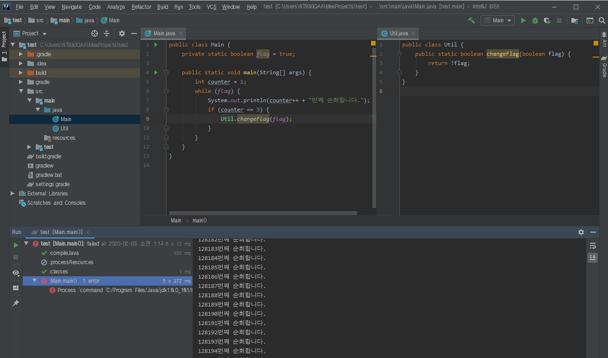
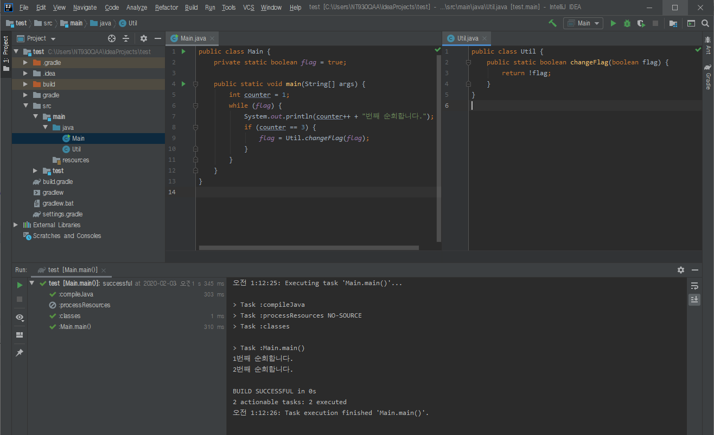
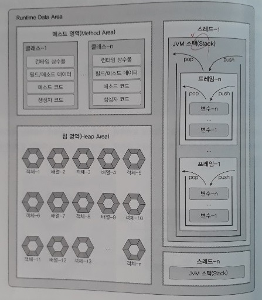

Static vs. Singleton
=====
* static에 대해 오해한 부분이 있어서 기록
* Singleton은 static의 대안  
  (개념서를 보면 static 다음에 Singleton 등장)
- - -
## 목차
1. [static](#static)
2. [Singleton](#Singleton)
3. [참고](#참고)

## static
static 멤버를 사용하면서 오해했던 부분은 클래스 간 공유가 된다고 생각했던 점(∵ static 멤버는 동일한 클래스의 모든 객체들에 의해 공유)이다. 아래는 코딩하며 오해했었던 부분들인데 기록으로 남겨둔다.

* 잘못된 사용 예시 1  
	 
* 잘못된 사용 예시 2  
	 
	 

즉, 클래스 간 공유를 위해서는 메서드 반환 타입을 통해 해당 클래스 필드를 변경시켜주어야 한다. 아래 그림을 보면 Runtime Data Area, 즉 프로그램을 실행하기 위해 JVM이 OS로부터 할당받은 메모리는 총 세 영역으로 구분된다.

 

* 메소드 영역(＝클래스 영역)
* 스택 영역
* 힙 영역

이중 메소드 영역에서 static 멤버를 관리하게 되는데 그림에서 보듯 클래스별로 관리하며, 모든 객체가 공유할 수 있다는 특징이 있다(∴ 멀티 스레드의 경우 비권장).

##### [목차로 이동](#목차)

## Singleton
최근 만들던 [직원 관리 프로그램](https://github.com/nara1030/EmployeeManagementSystem)에서 static 변수였던 직원 목록을 Singleton으로 변경하였다. 위에서 언급했던 클래스간 변수 공유의 번잡함과 객체 지향적이지 않다는 문제 때문이다. 싱글톤과 정적에 대해 [다음](https://javarevisited.blogspot.com/2013/03/difference-between-singleton-pattern-vs-static-class-java.html)에서 발췌해 남긴다.

1. Static class provides better performance than Singleton pattern, because static methods are bonded on compile time.
2. One more difference between Singleton and static is, ability to override. Since static methods in Java cannot be overridden, they leads to inflexibility. On the other hand, you can override methods defined in Singleton class by extending it.
3. Static classes are hard to mock and consequently hard to test than Singletons, which are pretty easy to mock and thus easy to test. It's easier to write JUnit test for Singleton than static classes, because you can pass mock object whenever Singleton is expected, e.g. into constructor or as method arguments.
4. If you requirements needs to maintain state then Singleton pattern is better choice than static class, because maintaining state in later case is nightmare and leads to subtle bugs.
5. Singleton classes can be lazy loaded if its an heavy object, but static class doesn't have such advantages and always eagerly loaded.
6. Many Dependency Injection framework manages Singleton quite well e.g. Spring, which makes using them very easy.

##### [목차로 이동](#목차)

## 참고
* [정적 멤버와 static](https://blog.naver.com/heartflow89/220959033435)
* [동적인 클래스 로딩과 ClassLoader](https://javacan.tistory.com/entry/1)
* [자바 메모리 구조](https://12bme.tistory.com/142)
* [Difference between Singleton Pattern vs Static Class in Java](https://javarevisited.blogspot.com/2013/03/difference-between-singleton-pattern-vs-static-class-java.html)
* [Spring 싱글톤과 Java 싱글톤 패턴의 차이](http://blog.daum.net/rollin/8097082)

##### [목차로 이동](#목차)
