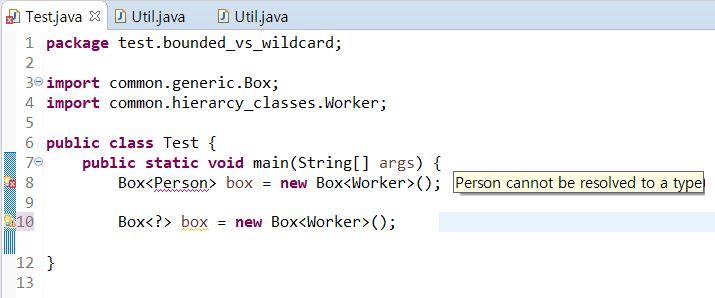
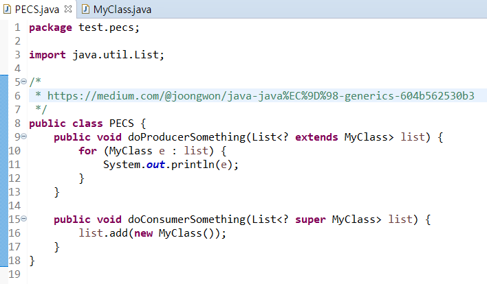

4주차 내용 정리
=========
* 2019.07.16(화): 쉼
* 2019.07.19(금): 13장 제네릭
- - - - -
### 목차
1. [개념](#개념)
	1. [제네릭 타입이란](#제네릭-타입이란)
	2. [왜 사용해야 하는가](#왜-사용해야-하는가)
2. [사용](#사용)
	1. [제네릭 메소드](#제네릭-메소드)
		* 제한된 타입 파라미터(<T extends 최상위타입>)
	2. [와일드카드 타입](#와일드카드-타입)
		* 세 가지 형태(<?>, <? extends ...>, <? super ...>)
	3. [제네릭 타입의 상속과 구현](#제네릭-타입의-상속과-구현)
3. [예제](#예제)
4. [심화](#심화)
5. [참고](#참고)
	1. [히스토리](#히스토리)
	2. [레퍼런스](#레퍼런스)
	3. [피드백](#피드백)

- - - - -

## 개념 
### 제네릭 타입이란
* 제네릭 타입은 타입을 파라미터로 가지는 `클래스와 인터페이스`를 말한다.
	* 예시  
	```java
	public class 클래스명<T> { ... }
	public interface 인터페이스명<T> { ... }
	```
* 제네릭 타입은 두 개 이상의 멀티 타입 파라미터를 사용할 수 있는데, 이 경우 각 타입 파라미터를 콤마로 구분한다.
	* 예시  
	```java
	public class 클래스명<T, M> { ... }
	```
* 제네릭 타입을 실제 코드에서 사용하려면 타입 파라미터에 구체적인 타입을 지정해야 한다.
	* 예시  
	```java
	// main() 메소드 안
	Box<String> box = new Box<String>();
	```
	* 클래스 내부에서 사용할 데이터 타입을 인스턴스를 생성할 때 확정하는 것이다.
		* 스터디에서 언급됐던 말인데 컴파일 시점만 생각하다보니 말을 그대로 듣지 못했다. 제네릭 타입이 클래스 멤버에 대한 타입을 의미하므로, 생성과 동시에 멤버의 타입이 확정되는 것이 맞다. 위의 코드에서 등호 우측편만 보면 된다.

##### [목차로 이동](#목차)
		
### 왜 사용해야 하는가
책에 두 가지 이유가 적혀 있다.

* 컴파일 시 강한 타입 체크를 할 수 있다.
* 타입 변환(casting)을 제거한다.

첫 번째 이유가 근거가 될 수 있는 이유는 실행 시 타입 에러가 나는 것보다는 컴파일 시에 미리 타입을 강하게 체크해서 에러를 사전에 방지하는 것이 좋기 때문이다. 즉, 런타임이 아니라 컴파일 타임에 타입을 체크하기 위함이다. 하지만 (내 식대로 해석해보자면) 강한 컴파일 시점에서의 타입 체크는 자바의 장점, 즉 [다형성](https://brunch.co.kr/@mystoryg/60)을 쓸 수 없게 한다.  

</br>

```java
Number num1 = new Integer(100);         → ●
Integer num2 = new Integer(100);        → ●

Box<Integer> box1 = new Box<Integer>(); → ●
Box<Number> box1 = new Box<Integer>();  → x
```

제네릭을 지양해야 된다고 들은 것 같은데, 그 이유가 아마 위의 맥락이 아닐까 한다. 예를 들어, 아래와 같은 메소드를 들 수 있다.  

```java
public void boxTest(Box<Number> n) { ... }

boxTest(new Box<Double>());
boxTest(new Box<Integer>());
```

컴파일 에러가 발생한다. 쭉 얘기했듯 `Box<Number>`는 `Box<Double>` 혹은 `Box<Integer>`의 부모가 아니기 때문이다. (제네릭을 사용하지 않으면 된다는 극단적 경우를 제외하면) 이에 대한 해결책은 추후 살펴볼 와일드카드의 사용인 것 같다.  

</br>

##### [목차로 이동](#목차)

## 사용 
### 제네릭 메소드
제네릭 메소드(<T, R> R method(T t))는 매개 타입과 리턴 타입으로 타입 파라미터를 갖는 메소드를 말한다.  

```java
public static <T> Box<T> boxing(T t) {
	Box<T> box = new Box<T>();
	box.set(t);
	return box;
}
```

위와 같은 예를 들 수 있는데 두 가지 문제가 있다.  

* 사용자가 메소드 매개변수(T)로 원하지 않는 타입을 넣어줄 수 있다.
* ~~정적 메소드임에도 객체를 생성해서 사용한다.~~
	* 이건 다시 생각해보니 이상한 부분은 아닌 거 같다.
		* static/인스턴스 메소드의 구분은 멤버의 사용인데 사용이 아니고 생성이 목적이니까
	* 단, 클라이언트(생성의 주체) 관련해서 객체 의존성을 한 번 생각해볼 필요가 있을 것 같다.

```java
public static <T extends Number> int compare(T t1, T t2) {
	double v1 = t1.doubleValue();
	double v2 = t2.doubleValue();
	return Double.compare(v1, v2);
}
```

이 두 문제는 위처럼 제한된 타입 파라미터(bounded type parameter)를 통해 해결할 수 있다. T의 상위 타입을 제한해줌으로써 지정된 타입 이외에 매개변수 전달시 컴파일 타임에서 에러를 잡아준다. 또한 위 코드에서 extends Number를 없애보면 doubleValue() 메소드 부분에 에러가 뜨는데, 즉 컴파일 타임에 상위 타입을 지정해줌으로써 구현 클래스의 메소드를 사용할 수 있음을 알 수 있다.  

* [compare() 메소드](https://docs.oracle.com/javase/8/docs/api/java/util/Comparator.html)는 컬렉션 사용 시 정렬 구현할 때 재정의해서 사용하곤 한다.
	* [컬렉션 프레임워크는 제네릭을 기반으로 구성되어 있다.](http://ehpub.co.kr/java-%ED%99%9C%EC%9A%A9-3-%EC%A0%9C%EB%84%A4%EB%A6%AD%EA%B3%BC-%EC%BB%AC%EB%A0%89%EC%85%98/)

참고로 상위 타입은 클래스뿐만 아니라 인터페이스도 가능하다. 단, 인터페이스라고 해서 implements를 사용하지 않는다.

##### [목차로 이동](#목차)

### 와일드카드 타입

코드에서 ?를 와일드카드라고 부른다. 그리고 와일드카드 타입으론 세 가지 형태가 존재한다.  

* 제네릭타입<?>: Unbounded Wildcards
	* 타입 파라미터를 대치하는 구체적 타입으로 모든 클래스나 인터페이스 타입이 올 수 있다.
* 제네릭타입<? extends 상위타입>: Upper Bounded Wildcards
	* 타입 파라미터를 대치하는 구체적인 타입으로 상위 타입이나 그 하위 타입만 올 수 있다.
* 제네릭타입<? super 하위타입>: Lower Bounded Wildcards
	* 타입 파라미터를 대치하는 구체적인 타입으로 하위 타입이나 그 상위 타입이 올 수 있다.

이 부분에서 제네릭 타입과 와일드카드 타입의 차이점에 대해 의문이 들었다. 아래 경우를 보자.  

* 1번. public `<T extends Animal>` void takeThing(`ArrayList<T>` list)
* 2번. public void takeThing(ArrayList`<? extends Animal>` list)

1번은 제네릭 타입, 2번은 와일드카드를 사용했지만 둘 사이의 차이를 설명하기 힘들다. 그렇다면 왜 와일드카드 타입이 필요한가? ~~여기서부턴 추측이므로 공부하는대로 정리해야 한다.~~  

바로 다형성을 보완하기 위해서이다. **왜 사용해야 하는가**에서 언급했듯 제네릭의 장점인 컴파일 타임에서의 강한 타입 체크는 다형성이란 장점을 사용할 수 없게 한다. 두 가지 예로 설명해보려 한다.  

1. 메소드에서 제네릭 타입을 받아야 하는 경우
	* 만약 클라이언트에서 타입 파라미터를 제대로 추론하지 못하는 경우 문제가 생길 수 있다.
		* 따라서 이런 일을 방지하기 위해 공개 API를 작성할 때는 와일드 카드로 받으라고 하곤 한다(출처?).
	* 코드  
	</br>
2. 의도 반영 용이
	* 제네릭 타입과 다르게 와일드카드에는 super 키워드도 있음을 확인 가능
	* ~~결과적으로 위 1번과 2번은 같으나~~각 객체들간의 관계(생산자-소비자)를 고려 가능
		* 제네릭 타입만 써서는 소비(super)가 불가능
		* [언제 어떤 상황에서 extends를 사용하고 super를 사용할까?](https://medium.com/@joongwon/java-java%EC%9D%98-generics-604b562530b3)
			* Oracle 문서에서는 In, Out 개념으로 가이드 하고 있다. 예를 들어 copy(src, dest)라는 메소드가 있다고 하자. 여기서 src는 데이터를 복사할 데이터를 제공하므로 (생산) In 인자가 되고 dest는 다른 곳에서 사용할 데이터를 받아들이므로 (소비) Out 인자가 되므로 In의 경우 extends 키워드를 사용하고 Out의 경우는 super를 사용하라고 한다.
	* 코드  
	</br>

* 참고
	* 용어
		* 무공변(invariant): 오로지 자기 타입만 허용(`<T>`)
		* 공변(covariant): 구체적인 방향으로 타입 변환 허용(`<? extends T>`)
		* 반공변(contravariant): 추상적인 방향으로 타입 변환 허용(`<? super T>`)
	* 와일드카드를 쓴 자료구조 variable에는 add, addAll 등과 같은 메소드를 차단하여 향후 자료구조 내부 요소의 변경을 막는다.
		* 1번과 2번의 차이는 [와일드카드 캡처](https://docs.oracle.com/javase/tutorial/java/generics/capture.html)를 이용하기 위해 1의 경우 private Helper Method로 처리하는 거라고?

##### [목차로 이동](#목차)
		
### 제네릭 타입의 상속과 구현

##### [목차로 이동](#목차)

## 예제

##### [목차로 이동](#목차)

## 심화
1. `List<?>`에는 null 이외의 어떤 값도 넣을 수 없다?
	* [코드](https://okky.kr/article/355001)  
	```java
	List<?> list = new ArrayList<>();
	list.add(null);
	// list.add("String");
	```
2. PECS
	* Producer(생산자) - extends, Consumer(소비자) - super
	* [코드](https://medium.com/@joongwon/java-java%EC%9D%98-generics-604b562530b3)

##### [목차로 이동](#목차)
	
## 참고

### 히스토리
* JAVA 5부터 제네릭 타입이 추가되었다.
* JAVA 7부터 제네릭 타입 파라미터의 중복 기술을 줄이기 위해 다이아몬드 연산자 <>를 제공한다.

### 레퍼런스
* [Generics, Inheritance, and Subtypes](https://docs.oracle.com/javase/tutorial/java/generics/inheritance.html)
	* [Java의 Generics](https://medium.com/@joongwon/java-java%EC%9D%98-generics-604b562530b3)
* 제네릭 vs 와일드카드
	* [Generic 메소드 vs Wildcard 차이점에 대해](https://www.slipp.net/questions/202)
		* [Wildcard Capture and Helper Methods](https://docs.oracle.com/javase/tutorial/java/generics/capture.html)
	* [Java: Generic vs Wildcard](https://creator1022.tistory.com/142)
		* 설명이 좀 짧은 거 같은 느낌은 들지만 내가 잘 모르는 걸지도..
* Generics by 함호식님
	* [Generics1](https://medium.com/@hhs1253/generics-%EC%A0%9C%EB%84%88%EB%A6%AD%EC%8A%A4-59d6af9c6726)
	* [Generics2](https://medium.com/@hhs1253/generics2-5d2d2088f006)

##### [목차로 이동](#목차)
	
### 피드백
* 제네릭을 다형성과 결부시키면 안 된다.
	* 따라서 와일드카입이 제네릭의 해결책이 아니다.  
</br>

* 차이점: 제한된 타입 파라미터와 와일드 카드
	* 제한된 타입 파라미터: 제네릭 타입을 개발할 때 타입 파라미터를 제한할 목적
	* 와일드 카드: 이미 개발된 제네릭 타입을 매개 변수 타입이나 리턴 타입으로 사용할 때 타입 파라미터를 제한할 목적  
	</br>
	* 사용 예
		* 제한된 타입 파라미터: `<T extends  >`  
		</br>
			* 의문점  
			`1. 리스트를 재정의해준건가? List<Fruit>에 List<Apple>을 넣어준거 같은데. 아님 스트림의 기능?`  
			`2. 그럼 Fruit 클래스는 Eatable을 구현해준건가?`

* 기타
	* `<? super E>`  
	</br>
	* `List<?> list = new ArrayList<>();`  
	</br>

##### [목차로 이동](#목차)