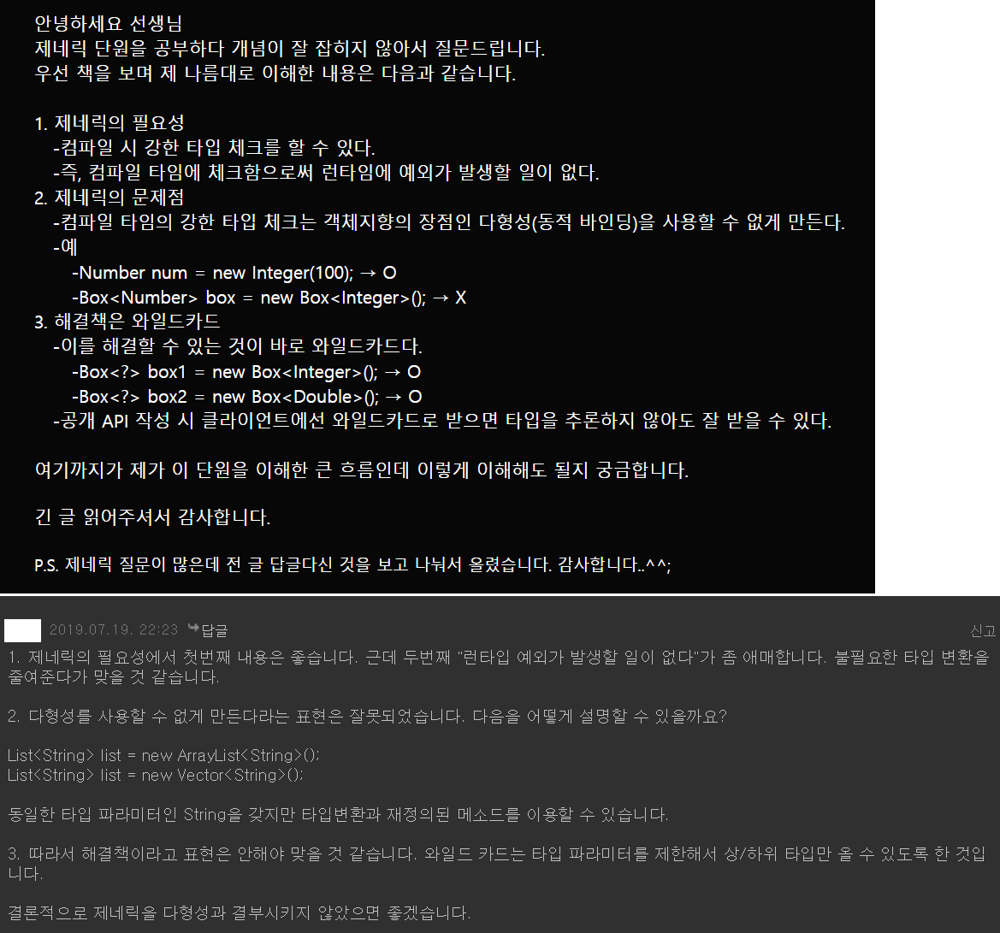
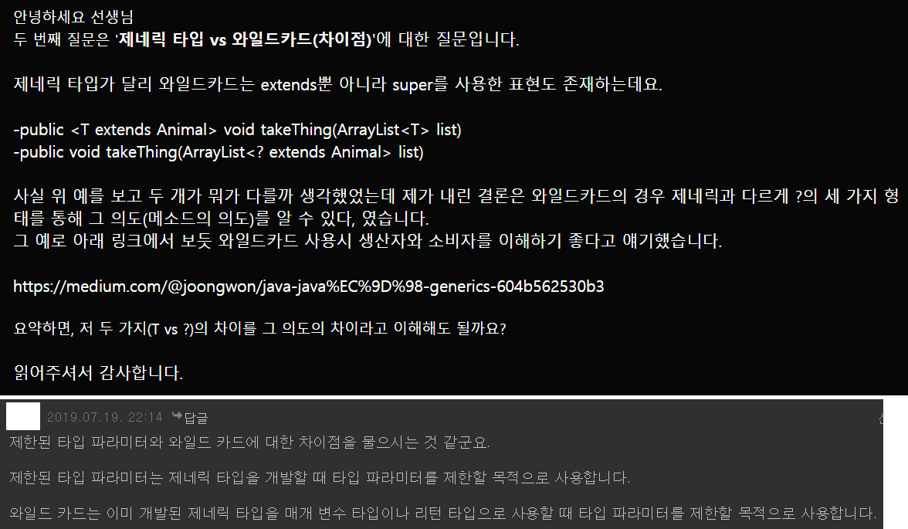
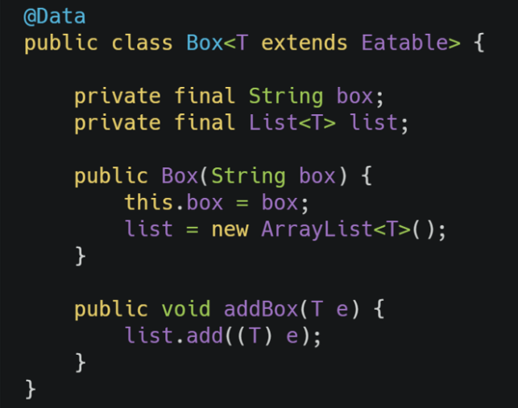
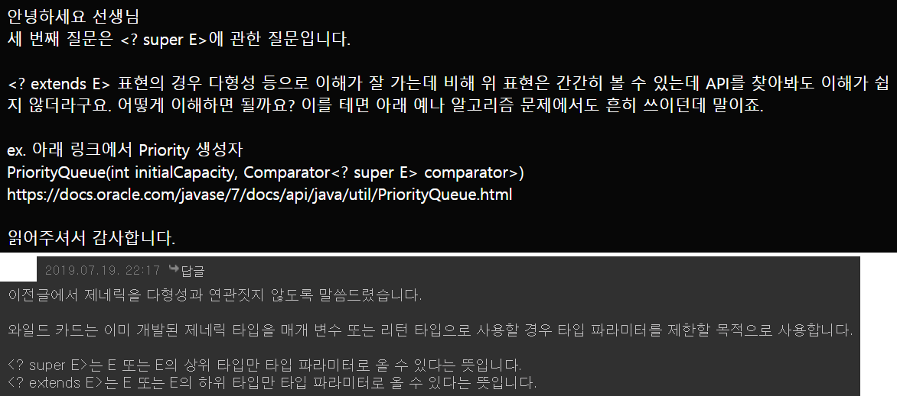
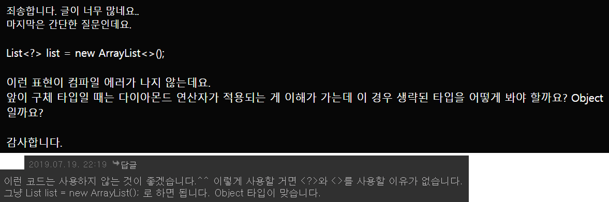

Generic
=========
Java Generic에 대해 공부한 내용을 정리한 것으로 [다음 글](https://slides.com/changyong/generics#/)을 많이 참고했다.

* JAVA 5: 제네릭 타입 추가
* JAVA 7: 제네릭 타입 파라미터의 중복 기술을 줄이기 위해 다이아몬드 연산자 <> 제공
- - - - -
### 목차
1. [개념](#개념)
	1. [제네릭 타입이란](#제네릭-타입이란)
	2. [왜 사용해야 하는가](#왜-사용해야-하는가)
2. [사용](#사용)
	1. [제네릭 클래스](#제네릭-클래스)
	2. [제네릭 메소드](#제네릭-메소드)
	3. [다형성](#다형성)
	4. [와일드 카드](#와일드-카드)
	5. [한정적 타입 파라미터](#한정적-타입-파라미터)
3. [참고](#참고)
	1. [Type Token](#Type-Token)
	2. [피드백](#피드백)

## 개념 
### 제네릭 타입이란
* 제네릭 타입은 타입을 파라미터로 가지는 `클래스와 인터페이스`를 말한다.
	* 예시  
	```java
	public class 클래스명<T> { ... }
	public interface 인터페이스명<T> { ... }
	```
* 제네릭 타입은 두 개 이상의 멀티 타입 파라미터를 사용할 수 있는데, 이 경우 각 타입 파라미터를 콤마로 구분한다.
	* 예시  
	```java
	public class 클래스명<T, M> { ... }
	```
* 제네릭 타입을 실제 코드에서 사용하려면 타입 파라미터에 구체적인 타입을 지정해야 한다.
	* 예시  
	```java
	// main() 메소드 안
	Box<String> box = new Box<String>();
	```
	* 클래스 내부에서 사용할 데이터 타입을 인스턴스를 생성할 때 확정하는 것이다.
		* 스터디에서 언급됐던 말인데 컴파일 시점만 생각하다보니 말을 그대로 듣지 못했다. 제네릭 타입이 클래스 멤버에 대한 타입을 의미하므로, 생성과 동시에 멤버의 타입이 확정되는 것이 맞다. 위의 코드에서 등호 우측편만 보면 된다.

##### [목차로 이동](#목차)
		
### 왜 사용해야 하는가
책에 두 가지 이유가 적혀 있다.

* 컴파일 시 강한 타입 체크를 할 수 있다.
* 타입 변환(casting)을 제거한다.

첫 번째 이유가 근거가 될 수 있는 이유는 실행 시 타입 에러가 나는 것보다는 컴파일 시에 미리 타입을 강하게 체크해서 에러를 사전에 방지하는 것이 좋기 때문이다. 즉, 런타임이 아니라 컴파일 타임에 타입을 체크하기 위함이다.

```java
// 1.5 이전
List list = new ArrayList();
list.add(30);
// String str = (String) list.get(0);	// Runtime Error
// 타입 안정성 보장 위한 코드
Object element = list.get(0);
if(element instanceof String) {
	String str = (String) element;
}

// 1.5 이후
List<String> list = new ArrayList<String>();
list.add("hello");
String str = list.get(0);
```

##### [목차로 이동](#목차)

## 사용
Generic은 대표적으로 Collection Library에서 사용한다.

### 제네릭 클래스
```java
class MyList<T> {
	private T[] ts;
	private int cursor;
	
	@SuppressWarnings("unchecked")
	MyList() {
		this.ts = (T[]) new Object[10];
	}
	
	void add(T t) {
		this.ts[cursor++] = t;
	}
	
	T get(int idx) {
		return this.ts[idx];
	}
}
```

사용 시 명시적으로 타입 아규먼트(`<T>`)를 지정해야 한다.

```java
MyList<String> myList = new MyList<String>();
myList.add("hello");
String str = myList.get(0);
```

##### [목차로 이동](#목차)

### 제네릭 메소드
```java
class MyList {
	private Object[] ts;
	private int cursor;
	
	MyList() {
		this.ts = new Object[10];
	}
	
	<T> void add (T t) {
		this.ts[cursor++] = t;
	}
	
	@SuppressWarnings("unchecked")
	<T> T get(int idx) {
		return (T) this.ts[idx];
	}
}
```

* 타입 파라미터를 클래스가 아닌 메서드에 지정
* List와 같이 하나의 타입을 다루는 자료구조성 라이브러리에는 어울리지 않음(∴ 유틸성 메소드 사용)
* 제네릭 클래스와 마찬가지로 사용할 수 있으며 좀 더 유연한 API 제공 가능

사용 시 명시적으로 타입 아규먼트 지정할 필요 없다. 즉 제네릭 메소드로 구현되어 있으나 사용하는 쪽에서는 제네릭이 적용되어 있음을 모른다.

```java
MyList myList = new MyList();
myList.add(123);
String str = myList.get(0);
```

조슈아 블로흐의 이펙티브 자바에 아래와 같이 언급되어 있다.
 
> * Item 29. 이왕이면 제네릭 타입으로 만들라
> * Item 30. 이왕이면 제네릭 메소드로 만들라
> * Item 31. 한정적 와일드 카드를 사용해 API 유연성을 높이라

##### [목차로 이동](#목차)

### 다형성
여기서 든 생각은 강한 컴파일 시점에서의 타입 체크는 자바의 장점, 즉 [다형성](https://brunch.co.kr/@mystoryg/60)을 쓸 수 없게 하는 것이 아닌가 하는 점이었다.

```java
// EX01
Number num1 = new Integer(100);         → ●
Integer num2 = new Integer(100);        → ●

Box<Integer> box1 = new Box<Integer>(); → ●
Box<Number> box1 = new Box<Integer>();  → x

// EX02
public void boxTest(Box<Number> n) { ... }

boxTest(new Box<Double>());
boxTest(new Box<Integer>());
```

</br>

여기서 세 가지 개념이 등장한다.

* Covariant  
	```java
	// 배열은 대표적 공변 타입
	// 즉 String은 Object의 하위 타입이므로 String[]이 Object[]의 하위 타입
	Object[] os = new String[10];
	// 배열의 공변성으로 발생하는 문제
	os[0] = 10;
	```
* Invariant(cf. Immutable)  
	```java
	// ArrayList<Object> os = new ArrayList<String>();	// Compile Error
	
	/*
	 * - 제네릭은 타입(T)에 따라 리스트의 타입이 변하지 않음
	 * - ArrayList<Object>와 ArrayList<String>은 상하위 개념이 아닌 다른 타입
	 */
	```
	* Immutable이 값/상태의 불변이라면 Invariant는 성질/타입의 불변
* Contravariant

##### [목차로 이동](#목차)

### 와일드 카드
그렇다면 다형성(?), 다시 말해 모든 타입을 받는 제네릭 클래스를 어떻게 만들 수 있을까?

```java
// 배열
public static void method(Object[] os) {
}

// 리스트
public static void method(List<Object> list) {
}

// 컴파일 에러 발생(∵ 제네릭 클래스는 Invariant)
// method(new ArrayList<String>());
// method(new ArrayList<Integer>());
```

이 경우 두 가지의 해결 방법이 존재(여전히 존재하는 [문제점](#한정적-타입-파라미터))한다.

1. 와일드 카드  
	```java
	public static void main(String[] args) {
		method(new ArrayList<String>());
		method(new ArrayList<Integer>());		
	}
	
	// 타입 파라미터의 제한이 없을 때 와일드 카드 사용
	public static void method(List<?> list) {
	}
	```
2. 제네릭 메소드  
	```java
	public static void main(String[] args) {
		method(new ArrayList<String>());
		method(new ArrayList<Integer>());		
	}
	
	public static <T> void method(List<T> list) {
	}
	```

그렇다면 이 두 가지 중 어떤 것을 사용해야 할까? 이 두 방법의 가장 큰 차이는 와일드 카드는 타입을 캡쳐하지 않는다는 것에 있다. 아래 예는 단지 관례(Convention)이며 메소드 시그니처만으로 이 메소드의 구현부를 추론할 때 사용한다.

* 메소드 내에서 해당 제네릭 타입 사용 혹은 반환 타입 지정 경우 → 제네릭 메소드  
	```java
	public static <T> T get(List<T> list, int idx) {
		return list.get(idx);
	}
	```
	* 와일드 카드는 타입을 캡쳐하지 않으므로 반환값으로 사용할 수 없음
* 메소드 내에서 제네릭 타입 사용 않는 경우 → 와일드 카드  
	```java
	public static boolean contains(List<?> list, Object object) {
		return list.contains(object);
	}
	```
	* 메소드 내에서 제네릭 정보를 사용하지 않고, 반환값도 제네릭과는 관계 없음

List의 순서를 바꾸는 메소드를 생각해본다.

```java
public static void reverse(List<?> list) {
	int last = list.size() - 1;
	for(int i = 0, length = list.size() / 2; i <= length; i++) {
		Object element = list.get(i);
		list.set(i, list.get(last - i));
		list.set(last - i, element);
	}
}
```

이 코드는 컴파일 에러를 발생(∵ 와일드 카드는 타입 캡쳐 안함)시키므로 다음과 같이 수정할 수 있다.

```java
public static void reverse(List<?> list) {
	helper(list);
}

private static <T> void helper(List<T> list) {
	int last = list.size() - 1;
	for(int i = 0, length = list.size() / 2; i <= length; i++) {
		T element = list.get(i);
		list.set(i, list.get(last - i));
		list.set(last - i, element);
	}
}
```

애초에 제네릭 메소드로 만들면 helper 메소드가 필요치 않지만 위처럼 수정한 이유는 메소드 시그니처만으로 메소드를 알리기 위함이다. 공개된 메소드의 시그니처가 제네릭 메소드라면 메소드 내부에서 타입을 필요로 한다는 의미이기 때문이다.

- - -
사실 모든 타입을 받는 제네릭 클래스를 만드는 방법은 하나 더 존재한다. 바로 Raw Type을 사용하는 것이다.

```java
public static void main(String[] args) {
	method(new ArrayList<String>());
	method(new ArrayList<Integer>());
}

public static void method(List list) {
}
```

자바 5에 제네릭이 추가되면서 많은 자바 인터페이스(Collection, Class 등) 스펙이 변경되었다. 이러한 변경에도 불구 Raw 타입을 지원하는 이유는 하위 호환 때문이고, 자바 5 이상이라면 Raw 타입 사용을 권장하지 않는다(∴ 컴파일러가 warnning 발생).

> * Item 26. Raw type은 사용하지 말라

##### [목차로 이동](#목차)

### 한정적 타입 파라미터
```java
class ToyList<T> {
	private T[] ts;
	private int cursor;
	
	@SuppressWarnings("unchecked")
	ToyList() {
		this.ts = (T[]) new Object[10];
	}
	
	void add(T t) {
		this.ts[cursor++] = t;
	}
	
	T get(int idx) {
		return this.ts[idx];
	}
}

interface Toy {}

class Robot implements Toy {}
class Drone implements Toy {}
```

ToyList에 Toy 인터페이스의 구현체들만 담고 싶지만 현재는 아래 코드를 막을 수 없다.

```java
ToyList<String> robots = new ToyList<>();
```

이는 한정적 타입 파라미터(Bounded Type Parameter)를 사용하여 해결 가능하다.

```java
class ToyList<T extends Toy> { ... }

// ToyList<String> robots = new ToyList<>();	// Compile Error
```

이는 제네릭 메소드 혹은 와일드 카드의 단점을 메꿔줄 수 있다. 즉 Object에 대해서만 가능했던 공변을 특정 타입에 대해 구현할 수 있다.

```java
public static <T extends Numbeer> void method(List<T> numbers) {}

method(new ArrayList<Integer>());
method(new ArrayList<Long>());
// method(new ArrayList<String>());	// Compile Error
```

* extends, super 키워드를 사용하여 더 구체적인 타입에 대한 공변/반공변 가능
* PECS(Producer-Extends, Consumer-Super)  
	```java
	// ArrayList 클래스 선언부
	public boolean add(E e)
	public void sort(Comparator<? super E> c) {}
	public boolean addAll(Collection<? extends E> c) {}
	public void forEach(Consumer<? super E> action) {}
	
	// EX
	List<Number> list1 = new ArrayList<>();
	List<Integer> list2 = new ArrayList<>();
	list1.addAll(list2);
	```
	* 즉 생산의 개념이면 extends를, 소비의 개념이면 super를 사용
		* 생산이란 내부 데이터를 꺼내는 것이고, 소비란 메소드의 인자를 사용하는 것
		* 간단히 생각해서 get 메소드는 extends, add 메소드는 super
	* 만약 addAll 메소드의 시그니처가 Collection<? extends E>가 아닌 Collection<E>였다면 불공변(invariant)이므로 컴파일 에러 발생
		* addAll 메소드는 인자인 Collection의 내부 데이터를 모두 꺼내므로 extends
		* 반면 sort 메소드의 경우 역시 Element를 Comparator의 compare() 메소드에서 사용하므로 super

##### [목차로 이동](#목차)

## 참고
* [Generics by Leopold](https://medium.com/@joongwon/java-java%EC%9D%98-generics-604b562530b3)
* [Generics by 꿀벌개발자](https://ohgyun.com/51)
* [Generics by 함호식](https://medium.com/@hhs1253/generics2-5d2d2088f006)
* [제네릭과 가변성 by HAPPINESSONCODE](http://happinessoncode.com/2017/05/22/java-generic-and-variance-2/)
* [Generic - Raw Type을 쓰면 안되는 이유 by HAPPINESSONCODE](http://happinessoncode.com/2018/02/08/java-generic-raw-type/)
* Generic method vs Wildcard
	* [제네릭 메소드와 와일드 카드의 차이점에 대해](https://www.slipp.net/questions/202)
		* [Wildcard Capture and Helper Methods](https://docs.oracle.com/javase/tutorial/java/generics/capture.html)
	* [Generic method vs Wildcard](https://creator1022.tistory.com/142)	
* stackoverflow
	* [What is a difference between `<? super E>` and `<? extends E>`?](https://stackoverflow.com/questions/1368166/what-is-a-difference-between-super-e-and-extends-e)
	* [Difference between `<? super T>` and `<? extends T>` in Java](https://stackoverflow.com/questions/4343202/difference-between-super-t-and-extends-t-in-java)
* [Java Generics PECS - Producer Extends Consumer Super](https://howtodoinjava.com/java/generics/java-generics-what-is-pecs-producer-extends-consumer-super/)
* [Effective Java 5장 제네릭](http://rangken.github.io/blog/2015/effective-java-4/)
* [컬렉션 프레임워크는 제네릭을 기반으로 구성되어 있다.](http://ehpub.co.kr/java-%ED%99%9C%EC%9A%A9-3-%EC%A0%9C%EB%84%A4%EB%A6%AD%EA%B3%BC-%EC%BB%AC%EB%A0%89%EC%85%98/)

### Type Token
자바의 제네릭은 타입 소멸 방식으로 구현됐기 때문에 리플렉션 API로 제네릭 정보를 구할 수 없다(∵ 런타임 시 제네릭 정보 소멸). 다만 몇 가지 경우에 타입 소멸이 되지 않아 제네릭 정보를 구할 수 있다.

```java
class Super<T> {}
class Sub extends Super<String> {}

Sub sub = new Sub();
ParameterizedType type = (ParameterizedType) sub.getClass().getGenericSuperclass();	// 상위 타입의 정보를 구함
Type[] types = type.getActualTypeArguments();			// 제네릭 정보를 배열로 얻음
String typeName = types[0].getTypeName();				// 첫 번째 타입 파라미터의 이름을 구함
```

##### [목차로 이동](#목차)
	
### 피드백
* 제네릭을 다형성과 결부시키면 안 된다.
	* 따라서 와일드카입이 제네릭의 해결책이 아니다.  
</br>

* 차이점: 제한된 타입 파라미터와 와일드 카드
	* 제한된 타입 파라미터: 제네릭 타입을 개발할 때 타입 파라미터를 제한할 목적
	* 와일드 카드: 이미 개발된 제네릭 타입을 매개 변수 타입이나 리턴 타입으로 사용할 때 타입 파라미터를 제한할 목적  
	</br>
	* 사용 예
		* 제한된 타입 파라미터: `<T extends  >`  
		</br>
			* 의문점  
			`1. 리스트를 재정의해준건가? List<Fruit>에 List<Apple>을 넣어준거 같은데. 아님 스트림의 기능?`  
			`2. 그럼 Fruit 클래스는 Eatable을 구현해준건가?`

* 기타
	* `<? super E>`  
	</br>
	* `List<?> list = new ArrayList<>();`  
	</br>
	* 용어
		* 무공변(invariant): 오로지 자기 타입만 허용(`<T>`)
		* 공변(covariant): 구체적인 방향으로 타입 변환 허용(`<? extends T>`)
		* 반공변(contravariant): 추상적인 방향으로 타입 변환 허용(`<? super T>`)
	* 와일드카드를 쓴 자료구조 variable에는 add, addAll 등과 같은 메소드를 차단하여 향후 자료구조 내부 요소의 변경을 막는다.
		* 1번과 2번의 차이는 [와일드카드 캡처](https://docs.oracle.com/javase/tutorial/java/generics/capture.html)를 이용하기 위해 1의 경우 private Helper Method로 처리하는 거라고?

##### [목차로 이동](#목차)