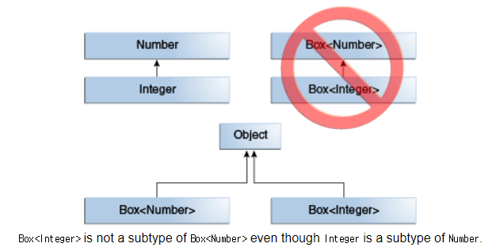

4주차 내용 정리
=========
* 2019.07.16(화): 쉼
* 2019.07.19(금): 13장 제네릭
- - - - -
### 목차
1. [개념](#개념)
	1. [제네릭 타입이란](#제네릭-타입이란)
	2. [왜 사용해야 하는가](#왜-사용해야-하는가)
2. [사용](#사용)
	1. [제네릭 메소드](#제네릭-메소드)
		* 제한된 타입 파라미터(<T extends 최상위타입>)
	2. [와일드카드 타입](#와일드카드-타입)
		* <?>, <? extends ...>, <? super ...>
	3. [제네릭 타입의 상속과 구현](#제네릭-타입의-상속과-구현)
3. [참고](#참고)
	1. [히스토리](#히스토리)
	2. [레퍼런스](#레퍼런스)

- - - - -

## 개념 
### 제네릭 타입이란
* 제네릭 타입은 타입을 파라미터로 가지는 클래스와 인터페이스를 말한다.
	* 예시  
	```java
	public class 클래스명<T> { ... }
	public interface 인터페이스명<T> { ... }
	```
* 제네릭 타입은 두 개 이상의 멀티 타입 파라미터를 사용할 수 있는데, 이 경우 각 타입 파라미터를 콤마로 구분한다.
	* 예시  
	```java
	public class 클래스명<T, M> { ... }
	```
* 제네릭 타입을 실제 코드에서 사용하려면 타입 파라미터에 구체적인 타입을 지정해야 한다.
	* 예시  
	```java
	// main() 메소드 안
	Box<String> box = new Box<String>();
	```

### 왜 사용해야 하는가
책에 두 가지 이유가 적혀 있다.

* 컴파일 시 강한 타입 체크를 할 수 있다.
* 타입 변환(casting)을 제거한다.

첫 번째 이유가 근거가 될 수 있는 이유는 실행 시 타입 에러가 나는 것보다는 컴파일 시에 미리 타입을 강하게 체크해서 에러를 사전에 방지하는 것이 좋기 때문이다. 즉, 런타임이 아니라 컴파일 타임에 타입을 체크하기 위함이다. 하지만 (내 식대로 해석해보자면) 강한 컴파일 시점에서의 타입 체크는 자바의 장점, 즉 [다형성](https://brunch.co.kr/@mystoryg/60)을 쓸 수 없게 한다.  

</br>

```java
Integer
Number num1 = new Integer(100);         → ●
Integer num2 = new Integer(100);        → ●

Box<Integer> box1 = new Box<Integer>(); → ●
Box<Number> box1 = new Box<Integer>();  → x
```

? T
매개변수 사용시엔 전달상 의미
받을 때
T super dfs가 없는 걸..

## 사용 
### 제네릭 메소드
제네릭 메소드(<T, R> R method(T t))는 매개 타입과 리턴 타입으로 타입 파라미터를 갖는 메소드를 말한다.  

```java
public static <T> Box<T> boxing(T t) {
	Box<T> box = new Box<T>();
	box.set(t);
	return box;
}
```

위와 같은 예를 들 수 있는데 두 가지 문제가 있다.  

* 사용자가 메소드 매개변수(T)로 원하지 않는 타입을 넣어줄 수 있다.
* 정적 메소드임에도 객체를 생성해서 사용한다(자연스럽지 않게 느껴져서 확인 필요).

```java
public static <T extends Number> int compare(T t1, T t2) {
	double v1 = t1.doubleValue();
	double v2 = t2.doubleValue();
	return Double.compare(v1, v2);
}
```

이 두 문제는 위처럼 제한된 타입 파라미터(bounded type parameter)를 통해 해결할 수 있다. T의 상위 타입을 제한해줌으로써 지정된 타입 이외에 매개변수 전달시 컴파일 타임에서 에러를 잡아준다. 또한 위 코드에서 extends Number를 없애보면 doubleValue() 메소드 부분에 에러가 뜨는데, 즉 컴파일 타임에 상위 타입을 지정해줌으로써 구현 클래스의 메소드를 사용할 수 있음을 알 수 있다.  

### 와일드카드 타입

코드에서 ?를 와일드카드라고 부른다. 그리고 와일드카드 타입으론 세 가지 형태가 존재한다.  

* 제네릭타입<?>: Unbounded Wildcards
	* 타입 파라미터를 대치하는 구체적 타입으로 모든 클래스나 인터페이스 타입이 올 수 있다.
* 제네릭타입<? extends 상위타입>: Upper Bounded Wildcards
	* 타입 파라미터를 대치하는 구체적인 타입으로 상위 타입이나 그 하위 타입만 올 수 있다.
* 제네릭타입<? super 하위타입>: Lower Bounded Wildcards
	* 타입 파라미터를 대치하는 구체적인 타입으로 하위 타입이나 그 상위 타입이 올 수 있다.

이 부분에서 제네릭 타입과 와일드카드 타입의 차이점에 대해 의문이 들었다. 즉, 왜 와일드카드 타입이 필요한가?  


### 제네릭 타입의 상속과 구현

## 참고

### 히스토리
* JAVA 5부터 제네릭 타입이 추가되었다.
* JAVA 7부터 제네릭 타입 파라미터의 중복 기술을 줄이기 위해 다이아몬드 연산자 <>를 제공한다.

### 레퍼런스
* [Generics, Inheritance, and Subtypes](https://docs.oracle.com/javase/tutorial/java/generics/inheritance.html)
	* [Java의 Generics](https://medium.com/@joongwon/java-java%EC%9D%98-generics-604b562530b3)
* 제네릭 vs 와일드카드
	* [참고 - 1](https://www.slipp.net/questions/202)
	* [참고 - 2](https://okky.kr/article/355001)
	* [참고 - 3](https://creator1022.tistory.com/142)