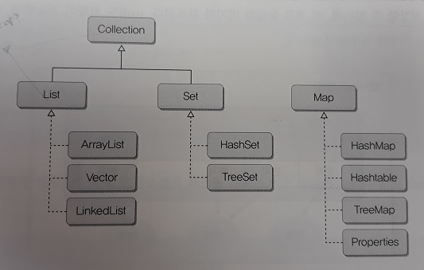
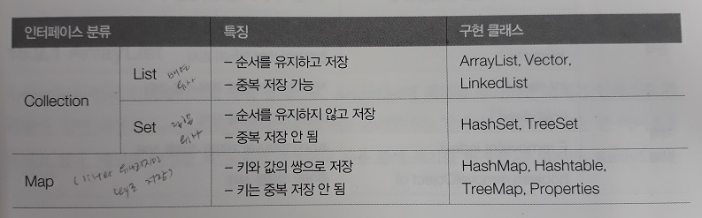
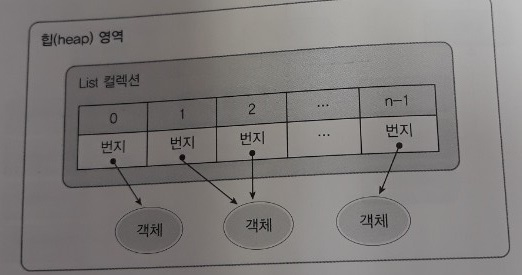

컬렉션 프레임워크
=========
* 2019.07.23(화): 컬렉션 프레임워크
- - - - -
## 목차
1. [필요성](#필요성)
2. [컬렉션 프레임워크](#컬렉션-프레임워크)
	* [List 컬렉션](#List-컬렉션)
	* [Set 컬렉션](#Set-컬렉션)
	* [Map 컬렉션](#Map-컬렉션)
3. [기능 추가](#기능-추가)
	* [검색 기능을 강화시킨 컬렉션](#검색-기능을-강화시킨-컬렉션)
	* [LIFO와 FIFO 컬렉션](#LIFO와-FIFO-컬렉션)
	* [동기화된 컬렉션](#동기화된-컬렉션)
	* [병렬 처리를 위한 컬렉션](#병렬-처리를-위한-컬렉션)
4. [연관](#연관)
5. [참고](#참고)

## 필요성
* 애플리케이션 개발 시 다수의 객체 저장해두고 필요할 때마다 꺼내 사용하는 경우 존재
	* 예. Course 클래스의 Student[] 멤버
	* 가장 간단한 방법은 위처럼 배열 이용하는 것
* 하지만 배열은 추가, 삭제 시 문제 있음
	* 이에 대한 대안으로 컬렉션 프레임워크 도입

## 컬렉션 프레임워크
* 컬렉션 프레임워크(Collection Framework)란
	* java.util 패키지에 있는 컬렉션과 관련된 인터페이스와 클래스들 총칭
		* 컬렉션 프레임워크의 주요 인터페이스로는 List, Set, Map이 있음
		* 기본적으로 이들 인터페이스는 제네릭 타입
			* 즉, 메소드의 매개 변수 타입과 리턴 타입에 E라는 타입 파라미터 존재
	* 객체들을 효율적으로 추가, 삭제, 검색
		* 널리 알려져 있는 자료구조 기반
		* 배열의 문제점 해결
	* List와 Set은 객체를 추가, 삭제, 검색하는 방법에 많은 공통점이 있기 떄문에 인터페이스들의 공통 메소드를 모아 Collection 인터페이스로 정의  
	 

* 용어
	* 인터페이스
		* 컬렉션들을 사용하는 방법을 정의한 것
	* 프레임워크
		* 사용 방법을 미리 정해놓은 라이브러리

요약하면 이렇다.  
 

### List 컬렉션
* List 컬렉션은 객체를 일렬로 늘어놓은 구조
	* 객체를 인덱스로 관리하기 때문에 객체를 저장하면 자동 인덱스 부여
		* 검색 시 인덱스 번호가 필요 없다면 향상된 for문 이용
	* 객체 자체를 저장하는 것이 아니라 객체의 번지를 참조  
	 
* List 인터페이스는 제네릭 타입
	* 구체적인 타입은 구현 객체를 생성할 때 결정
		* List`<String>` list = new ArrayList`<String>`();
	* 의문점
		* 파라미터가 Object인 것은 자바 4 이전 메소드인가?(ex. boolean contains(Object o))
* List 인터페이스 구현 클래스
	1. ArrayList
	2. Vector
	3. LinkedList

### Set 컬렉션

### Map 컬렉션

## 기능 추가

### 검색 기능을 강화시킨 컬렉션

### LIFO와 FIFO 컬렉션

### 동기화된 컬렉션

### 병렬 처리를 위한 컬렉션

## 연관

## 참고