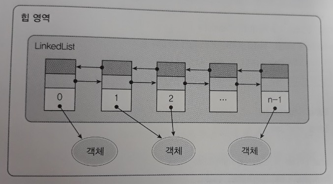
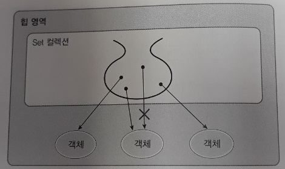
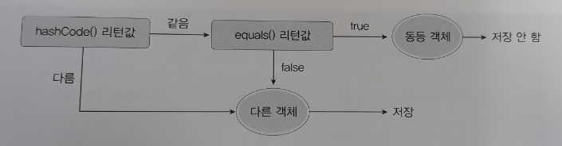
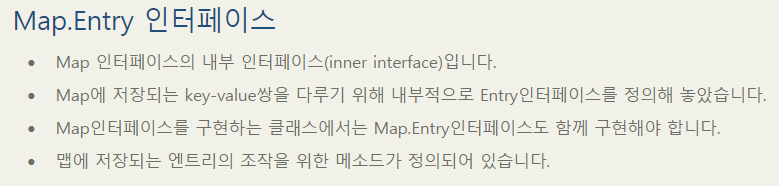
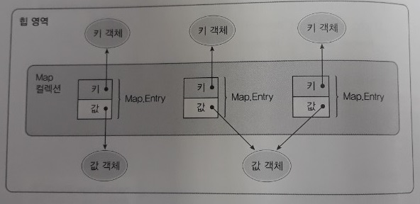
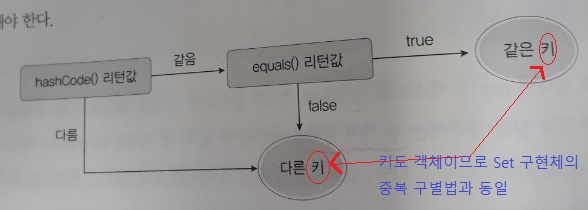

컬렉션 프레임워크
=========
* 2019.07.23(화): 컬렉션 프레임워크
- - - - -
## 목차
1. [필요성](#필요성)
2. [컬렉션 프레임워크](#컬렉션-프레임워크)
	* [List 컬렉션](#List-컬렉션)
	* [Set 컬렉션](#Set-컬렉션)
	* [Map 컬렉션](#Map-컬렉션)
3. [기능 추가](#기능-추가)
	* [검색 기능을 강화시킨 컬렉션](#검색-기능을-강화시킨-컬렉션)
	* [LIFO와 FIFO 컬렉션](#LIFO와-FIFO-컬렉션)
	* [동기화된 컬렉션](#동기화된-컬렉션)
	* [병렬 처리를 위한 컬렉션](#병렬-처리를-위한-컬렉션)
4. [연관](#연관)
5. [참고](#참고)

## 필요성
* 애플리케이션 개발 시 다수의 객체 저장해두고 필요할 때마다 꺼내 사용하는 경우 존재
	* 예. Course 클래스의 Student[] 멤버
	* 가장 간단한 방법은 위처럼 배열 이용하는 것
* 하지만 배열은 추가, 삭제 시 문제 있음
	* 이에 대한 대안으로 컬렉션 프레임워크 도입

## 컬렉션 프레임워크
* 컬렉션 프레임워크(Collection Framework)란
	* java.util 패키지에 있는 컬렉션과 관련된 인터페이스와 클래스들 총칭
		* 컬렉션 프레임워크의 주요 인터페이스로는 List, Set, Map이 있음
		* 기본적으로 이들 인터페이스는 제네릭 타입
			* 즉, 메소드의 매개 변수 타입과 리턴 타입에 E라는 타입 파라미터 존재
	* 객체들을 효율적으로 추가, 삭제, 검색
		* 널리 알려져 있는 자료구조 기반
		* 배열의 문제점 해결
	* List와 Set은 객체를 추가, 삭제, 검색하는 방법에 많은 공통점이 있기 떄문에 인터페이스들의 공통 메소드를 모아 Collection 인터페이스로 정의  
	</br>

* 용어
	* 인터페이스
		* 컬렉션들을 사용하는 방법을 정의한 것
		* 따라서 같은 인터페이스의 구현 클래스는 사용 방법이 같음!!
	* 프레임워크
		* 사용 방법을 미리 정해놓은 라이브러리

요약하면 이렇다.  
</br>

### List 컬렉션
* List 컬렉션은 객체를 일렬로 늘어놓은 구조
	* 객체를 인덱스로 관리하기 때문에 객체를 저장하면 자동 인덱스 부여
		* 검색 시 인덱스 번호가 필요 없다면 향상된 for문 이용
	* 객체 자체를 저장하는 것이 아니라 객체의 번지를 참조  
	</br>
* List 인터페이스는 제네릭 타입
	* 구체적인 타입은 구현 객체를 생성할 때 결정
		* List`<String>` list = new ArrayList`<String>`();
	* 의문점
		* 파라미터가 Object인 것은 자바 4 이전 메소드인가?(ex. boolean contains(Object o))
* List 인터페이스 구현 클래스
	1. ArrayList
		* 인덱스 검색이나, 맨 마지막에 객체를 추가하는 경우 사용
		* 고정된 객체들로 구성된 List를 생성하는 경우
			* List`<String>` list = Arrays.asList("홍길동", "신용권", "김자바");
			* 보통은 ArrayList 생성 후 런타임 시 객체를 추가해주는 것이 일반적
	2. Vector
		* ArrayList와 동일한 내부 구조, 그러나 동기화(synchronized)된 메소드로 구성
	3. LinkedList
		* 빈번한 객체 삭제와 삽입이 일어나는 경우 사용
		* ArrayList와 사용 방법은 똑같지만 내부 구조는 다름
			* ArrayList는 내부 배열에 객체를 저장해서 인덱스로 관리하지만, LinkedList는 인접 참조를 링크해서 체인처럼 관리  
			</br>

### Set 컬렉션
* Set 컬렉션은 순서는 무관하고, 중복 비허용
	* List 컬렉션은 저장 순서를 유지하지만 Set 컬렉션은 유지되지 않음
	* 객체를 중복해서 저장할 수 없고, 하나의 null만 저장 가능
* 중복 저장을 어떻게 막아놨을까?
	* 그림을 보면 `같은 객체`를 두 번 저장할 수 없음  
	</br>
	* 동일 객체 판별법(ex. HashSet)  
	</br>
		* 즉, HashSet은 객체를 저장하기 전에 먼저 객체의 hashCode() 메소드를 호출해서 해시코드를 알아낸다. 그리고 이미 저장되어 있는 객체들의 해시코드와 비교한다. 만약 동일한 해시코드가 있다면 다시 equals() 메소드로 두 객체를 비교해서 true가 나오면 동일한 객체로 판단하고 중복 저장을 하지 않는다.
		* 결과적으로 HashSet이 판단하는 `동일한 객체`란 꼭 `같은 인스턴스`를 뜻하지는 않는다.
* 인덱스가 없는데 어떻게 검색하지?
	* `Iterator<E> iterator()` 메소드
		* 저장된 전체 객체를 대상으로 한번씩 반복해서 가져오는 반복자(Iterator) 제공
		* 코드  
			```java
			Set<String> set = ...;
			Iterator<String> iterator = set.iterator();
			```
	* 사용법(Iterator 인터페이스 선언 메소드들)
		1. `boolean hasNext()`: 가져올 객체가 있으면 true를 리턴하고 없으면 false를 리턴  
		2. `E next()`: 컬렉션에서 하나의 객체를 가져옴
		3. `void remove()`: Set 컬렉션에서 객체를 제거
			* Iterator의 메소드지만 실제 Set 컬렉션에서 객체가 제거됨
				* 제거 방법 1  
					```java
					if(str.equals("홍길동") {
						iterator.remove();
					}
					```
			* 제거 방법 2  
				```java
				Set<String> set = new HashSet<>();
				set.add("JAVA");
				set.remove("JAVA");
				```
* Set 인터페이스 구현 클래스
	1. HashSet
	2. LinkedHashSet(**추후**)
	3. TreeSet(**추후**)

* 용어
	* 해시코드
		* [자바 해시코드](https://fors.tistory.com/81)
			* 주소와는 다른 개념이지만 인스턴스에 고유한 번호를 부여
			* Overide해서 사용하면 인스턴스가 아니라 객체별 구분 가능
	* 반복자(Iterator)란
		* Iterator 인터페이스를 구현한 객체
		* Set 인터페이스의 iterator() 메소드 호출함으로써 얻음
		* 의문점
			* 향상된 for문 있는데 굳이? 그리고 List에도 있는 거 같은데 잘 안쓴다는 건가?
			* 참고
				* [Collection과 Iterator](https://m.blog.naver.com/PostView.nhn?blogId=writer0713&logNo=220877874725&proxyReferer=https%3A%2F%2Fwww.google.com%2F)
				* [Differences between Iterator and Iterable in Java](https://www.techiedelight.com/differences-between-iterator-and-iterable-in-java/)

### Map 컬렉션
* Map 컬렉션
	* 구조
		* Map 컬렉션은 Entry 객체를 저장하는 구조를 가짐
			* [Map.Entry 인터페이스](https://codedragon.tistory.com/6046)  
			</br>
		* Entry 객체는 키(key)와 값(value)으로 구성됨
			* 즉, 키와 값을 삭제한다는 것은 Map.Entry를 삭제한다는 것
			* 여기서 키와 값은 모두 객체
		* Map 인터페이스를 통해 Map.Entry 조작  
		</br>
	* 특성
		* 키는 중복 저장될 수 없지만 값은 중복  
		</br>
		* 만약 기존 저장된 키와 동일한 키로 값을 저장하면 기존의 값은 없어지고 새로운 값으로 치환됨
	* 사용법
		* 키로 객체들을 관리하기 때문에 키를 매개값으로 갖는 메소드가 많음
			* `boolean containsKey(Object key)`
			* `V get(Object key)`
		* 검색(키를 모를 때)
			* `Set<Map.Entry<K,V>> entrySet()`  
				```java
				Set<Map.Entry<K, V>> entrySet = map.entrySet();
				Iterator<Map.Entry<K, V>> entryIterator = entrySet.iterator();
				while(entryIterator.hasNext()) {
					Map.Entry<K, V> entry = entryIterator.next();
					K key = entry.getKey();
					V value = entry.getValue();
				}
				```
				* [내부에 바로 접근할 수 있는 이유](https://docs.oracle.com/javase/8/docs/api/java/util/Map.Entry.html): `public static interface Map.Entry<K, V>`
			* `Set<K> keySet()`  
				```java
				Map<K, V> map = ~;
				Set<K> keySet = map.keySet();
				Iterator<K> keyIterator = keySet.iterator();
				while(keyIterator.hasNext()) {
					K key = keyIterator.next();
					V value = map.get(key);
				}
				```
* Map 인터페이스 구현 클래스
	1. HashMap
		* 주로 키 타입은 String을 많이 사용하는데, String은 문자열이 같을 경우 동등 객체가 될 수 있도록 hashCode()와 equals() 메소드가 재정의되어 있기 때문  
			```java
			Map<String, Integer> map = new HashMap<>();
			```
	2. Hashtable
		* HashMap과 동일한 내부 구조를 가지고 있으나 HashMap과 다르게 동기화(synchronized)된 메소드로 구성되어 있음
		* 의문점
			* Hashtable은 언제 사용해야 할까  
			`멀티스레드에서 해시테이블을 사용하기보다는 concurrent 패키지의 ConcurrentMap 인터페이스의 구현체(예. ConcurrentHashMap)를 사용하길 권장합니다. 해시테이블이란 JDK 1.0부터 있던 자바 API고, 해시맵은 JDK 2에서 처음 선보인 Java Collection Framework에 속학 API입니다.`
	3. LinkedHashMap(**추후**)
	4. Properties
		* Hashtable의 하위 클래스
			* Hashtable의 모든 특징 갖고 있음
			* 단, Hashtable은 키와 값을 다양한 타입으로 지정이 가능한데 비해 Properties는 키와 값을 String 타입으로 제한한 컬렉션
			* java.util.Properties
		* 외부 프로퍼티 파일(ex. 설정 정보)을 읽어오고 싶을 때
			* 애플리케이션의 옵션 정보
			* 데이터베이스 연결 정보
			* 국제화(다국어) 정보가 저장된 프로퍼티(~.properties) 파일
		* 의문점
			* 외부 프로퍼티 파일로 저장해야 하는 이유는 뭔데?
			* XML vs Properties
				* [자바에서 읽어오기](http://blog.naver.com/PostView.nhn?blogId=natural_e&logNo=220111990053&parentCategoryNo=&categoryNo=24&viewDate=&isShowPopularPosts=true&from=search)
				* [스프링에서 읽어오기](https://ktko.tistory.com/entry/Spring-properties-%EC%9D%BD%EC%96%B4%EC%98%A4%EA%B8%B0)
	5. TreeMap(**추후**)

## 기능 추가

### 검색 기능을 강화시킨 컬렉션
컬렉션 프레임워크는 검색 기능을 강화시킨 `TreeSet`과 `TreeMap`을 제공하고 있다. 이 컬렉션들은 이진 트리(binary tree)를 이용해서 계층적 구조(Tree 구조)를 가지면서 객체를 저장한다.

1. 이진 트리 구조
2. TreeSet
	* `TreeSet<String> treeSet = new TreeSet<String>`
		* Set 인터페이스 타입 변수에 대입해도 되지만 TreeSet 클래스 타입으로 대입한 이유는 객체를 찾거나 범위 검색과 관련된 메소드를 사용하기 위해서임
	* TreeSet이 갖고 있는 정렬과 관련된 메소드들
		* `Iterator<E> descendingIterator()`: 내림차순으로 정렬된 Iterator를 리턴
			* Set 컬렉션의 반복자 사용 참조
		* `NavigableSet<E> descendingSet()`: 내림차순으로 정렬된 NavigableSet을 리턴  
			```java
			NavigableSet<E> descendingSet = treeSet.descendingSet();
			NavigableSet<E> ascendingSet = descendingSet.descendingSet();
			```
3. TreeMap
4. Comparable과 Comparator

### LIFO와 FIFO 컬렉션

### 동기화된 컬렉션

### 병렬 처리를 위한 컬렉션

## 연관
* VO vs Map
* 커스터마이징
* `String.valueOf()`
	* 입력받은 인자 값을 지정된 Number 객체형으로 변환하여 반환
	* https://jamesdreaming.tistory.com/139
* 향상된 for문(Iterable)
	* Read only
	* https://bitsoul.tistory.com/57

## 참고
* Java8 docs
	* [List interface](https://docs.oracle.com/javase/8/docs/api/java/util/List.html)
	* [Set interface](https://docs.oracle.com/javase/8/docs/api/java/util/Set.html)
	* [Map interface](https://docs.oracle.com/javase/8/docs/api/java/util/Map.html)